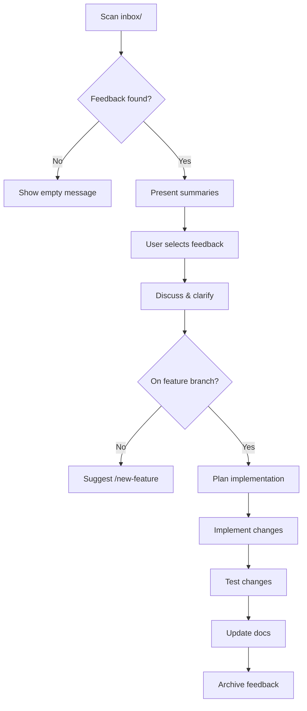

# Get Feedback - Process Inbox and Improve the Agent

Review feedback from the inbox, discuss what to implement, plan changes, and test them.

---

## Step 1: Scan Inbox

Check both feedback sources:

```bash
ls -la inbox/ideas/ 2>/dev/null || echo "NO_IDEAS_FOLDER"
ls -la inbox/from-projects/ 2>/dev/null || echo "NO_PROJECTS_FOLDER"
```

---

## Step 2: Present Feedback

For each markdown file found, read and summarize:

```
━━━━━━━━━━━━━━━━━━━━━━━━━━━━━━━━━━━━━━━━━━━━━━━━━━━━━━━━━━━━━━━━
 FEEDBACK INBOX
━━━━━━━━━━━━━━━━━━━━━━━━━━━━━━━━━━━━━━━━━━━━━━━━━━━━━━━━━━━━━━━━

## Your Ideas (inbox/ideas/)

1. [filename] - [one-line summary]
2. [filename] - [one-line summary]

## Project Feedback (inbox/from-projects/)

1. [filename] - [one-line summary]
2. [filename] - [one-line summary]

━━━━━━━━━━━━━━━━━━━━━━━━━━━━━━━━━━━━━━━━━━━━━━━━━━━━━━━━━━━━━━━━
```

If no feedback found:

```
━━━━━━━━━━━━━━━━━━━━━━━━━━━━━━━━━━━━━━━━━━━━━━━━━━━━━━━━━━━━━━━━
 FEEDBACK INBOX - Empty
━━━━━━━━━━━━━━━━━━━━━━━━━━━━━━━━━━━━━━━━━━━━━━━━━━━━━━━━━━━━━━━━

No feedback files found.

To add feedback:
• Drop ideas in inbox/ideas/
• Save project feedback to inbox/from-projects/

━━━━━━━━━━━━━━━━━━━━━━━━━━━━━━━━━━━━━━━━━━━━━━━━━━━━━━━━━━━━━━━━
```

---

## Step 3: Discuss and Select

Ask the user which feedback to work on:

- Read the full content of selected feedback file(s)
- Discuss the idea and clarify requirements
- Identify what changes would be needed
- Consider impact on existing functionality

---

## Step 4: Plan Implementation

Once feedback is selected:

1. **Check branch** - Must be on a feature branch (not main/master)
   - If on protected branch, suggest: `/new-feature "implement [feedback-name]"`

2. **Create implementation plan:**
   - What files need to change
   - What new files are needed
   - How to test the changes
   - Any risks or considerations

3. **Enter plan mode** if the changes are non-trivial

---

## Step 5: Implement and Test

After plan approval:

1. Make the changes
2. Test the changes (run commands, verify behavior)
3. Update documentation if needed (CLAUDE.md, README.md)
4. Mark feedback as processed

---

## Step 6: Archive Processed Feedback

After successful implementation, offer to archive the feedback:

```bash
# Move to processed folder (or delete if user prefers)
mkdir -p inbox/processed/
mv inbox/ideas/[filename] inbox/processed/
```

---

## Execution Flow



---

## Notes

- This is a collaborative workflow - discuss ideas before implementing
- Always work on a feature branch
- Test changes before considering them done
- Update CLAUDE.md if adding new commands or changing behavior
