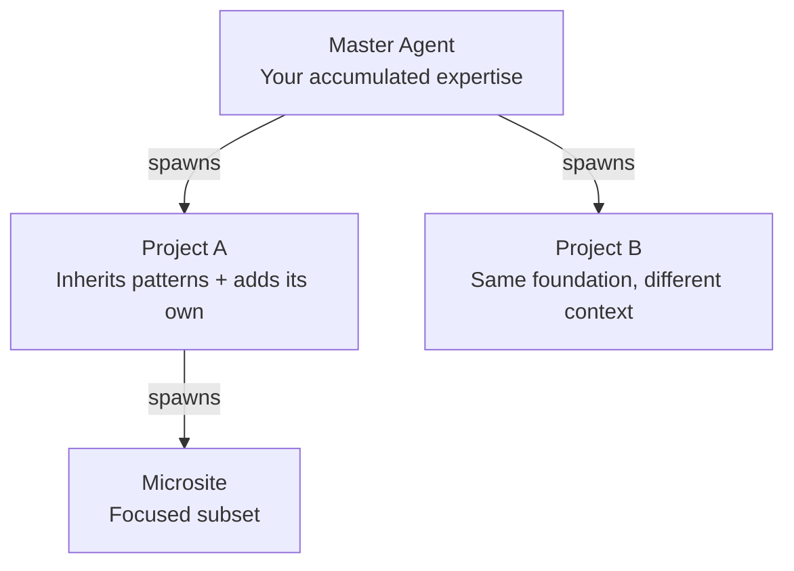
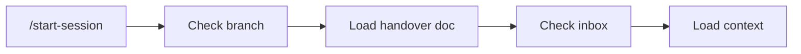
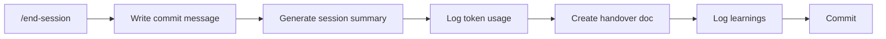

> **⚠️ Experimental** — Building in the open. Expect breaking changes.

# Squared Agent

Clone your expertise across every project.

Squared Agent is a master agent system that captures your development practices, patterns, and workflows — then deploys copies to new projects. Spawned projects can feed learnings back to the master, which propagates improvements to all other spawned agents. Your knowledge flows down, insights bubble up, and every project benefits.

**For:** Solo devs, small agencies, freelancers managing multiple projects.

**[Build Walkthrough: Gym Manager →](docs/build_walkthrough/gym_manager/article.md)** — See how a 15-minute discovery conversation turned a feature list into a complete technical design, then watch the agent build it in 45 minutes. Includes the spawned project: [SQLM-Gym-Manager](https://github.com/Squared-Lemons/SQLM-Gym-Manager).

## How It Works



Your master agent holds everything you've learned — workflows, framework patterns, gotchas. When you start a new project, run `/spawn-project` and it inherits your baseline. Each project can evolve independently, and spawned projects can spawn their own children.

Think franchise model: headquarters has the playbook, each location adapts to local needs.

## Key Features

**Session Workflow** — `/start-session` gets you oriented, `/end-session` wraps everything up. No more "where was I?"

**Safe Branching** — `/new-feature` creates isolated branches or worktrees. Protected branch detection stops accidental commits to main.

**Project Spawning** — `/spawn-project` creates new projects via guided discovery or template selection. Outputs a ready-to-go package with commands, knowledge, and setup instructions.

**Cost Visibility** — Token usage logged per session. Dashboard aggregates spend across all projects.

**Pass-Through Inheritance** — Spawned projects inherit your commands and can spawn their own children with their own additions.

### Session Flow





Run `/summary` anytime to see what you accomplished across sessions.

## Quick Start

```bash
# Download or fork the repo
cd Squared-Agent
pnpm install
pnpm build
```

Then in Claude Code:

```
/start-session          # Begin with context
/new-feature "my task"  # Safe branch
/end-session            # Wrap up + handover
/spawn-project          # Create a new project
```

## Project Structure

```
.claude/commands/    # Active commands you run
templates/           # Knowledge copied to spawned projects
packages/            # Publishable npm packages
apps/web/dashboard/  # Cost tracking UI
inbox/               # Ideas and feedback
outbox/              # Generated project packages
```

## Learn More

**[Full Documentation →](docs/README-detailed.md)** — Complete command reference, technical decisions, architecture details, and lessons learned.

## Feedback

Want to contribute improvements? Run `/agent-feedback` to generate a feedback file, then submit it via a [GitHub Issue](https://github.com/Squared-Lemons/Squared-Agent/issues).
