> **⚠️ Highly Experimental** — Building in the open. Expect breaking changes.

# Squared Agent

**Your expertise, codified. Delivered as intelligent systems.**

The agent is the product. Not just code — a complete intelligent assistant that carries your business practices, technical guidance, and operational knowledge. Build once, deploy to every client engagement. Let them control as much or as little as they need.

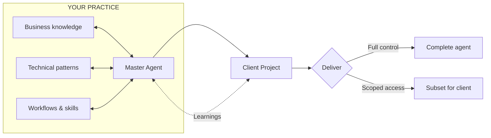

---

## The Model

**Master Agent** — Your home base. Contains your accumulated expertise: how you structure projects, which tools you trust, patterns that work, gotchas to avoid. This is your competitive advantage, encoded.

**Client Projects** — Spawned from your master. Each inherits your baseline, then evolves with project-specific knowledge. You develop the product here, with full agent capabilities.

**Client Delivery** — When the work is done, you choose what to hand over:
- **Full project** — Client gets everything, including the agent's learned context
- **Scoped subset** — Spawn a focused deliverable with only what they need to operate

All lessons learned from client projects ship back to your master agent via [`/agent-feedback`](docs/feedback.md). Your expertise compounds with every engagement. (Everything is local files — you control what gets shared by copying files yourself.)

The client receives an intelligent system, not just files. They can extend it, spawn their own children, or simply use what you've built.

**The Process You Deliver** — Beyond the product, you hand over a deployment pipeline matched to their current needs with a clear path forward. Clients get total local freedom — they can experiment, prototype, and test ideas without risk. Git and pull requests protect production: ideas can be demonstrated but never deployed without review.

```mermaid
flowchart LR
    subgraph Local["🔓 LOCAL FREEDOM"]
        A["Experiment"]
        B["Prototype"]
        C["Test ideas"]
        D["Demo to stakeholders"]
    end

    subgraph Safety["🛡️ SAFETY LAYER"]
        E["Git branch"]
        F["Pull request"]
        G["Review & approve"]
    end

    subgraph Production["🔒 PROTECTED"]
        H["Live system"]
    end

    A --> E
    B --> E
    C --> E
    D --> E
    E --> F
    F --> G
    G -->|"Approved"| H
    G -.->|"Rejected"| E
```

This separation means clients can move fast locally while maintaining the safety rails that prevent accidents in production.

---

## Why This Matters

| Traditional | With Squared Agent |
|-------------|-------------------|
| Deliver code, then onboard the client | Deliver an agent that already understands the system |
| Knowledge lives in your head | Knowledge lives in the agent, transferable |
| Each project starts from scratch | Each project builds on your accumulated expertise |
| Handoff means losing context | Handoff means transferring an intelligent assistant |
| Client asks "how does X work?" | Client asks the agent |
| Client changes break production | Git + PRs protect production; local freedom to experiment |

**The agent becomes documentation, onboarding, and institutional knowledge — all in one.**

---

## Quick Start

### 1. Set Up Your Master Agent

[Download the latest release](https://github.com/squared-lemons/squared-agent/archive/refs/heads/main.zip), unzip, and open:

```bash
cd squared-agent-main
git init
claude .
```

Then run `/start-session`. On first run, it will guide you through setup:
- Check prerequisites (Node.js, pnpm, git)
- Install dependencies automatically
- Create your local workspace (`.project/`)
- Optionally set up local HTTPS with friendly domains

This becomes your home base — completely yours. Customize it with your business practices, preferred tools, and technical patterns. No upstream connection to manage.

### 2. Start a Client Project

```
/spawn-project
```

Choose your approach:
- **Discuss & Design** — Discovery conversation to define the product
- **Use Template** — Quick setup from your existing configurations

### 3. Build the Product

Work in the spawned project with full agent capabilities. The agent inherits your expertise and learns project-specific context as you build.

### 4. Deliver to the Client

When ready, choose your delivery model:
- **Full handoff** — Copy the complete project (agent knowledge included)
- **Scoped delivery** — Run `/spawn-project` again to create a subset with only what the client needs

The client receives an intelligent system that can answer questions, extend itself, and maintain the work you've done.

---

## Installation

### Via Download (Recommended)

[Download the latest release](https://github.com/squared-lemons/squared-agent/archive/refs/heads/main.zip), unzip, then initialize your own git repo:

```bash
cd squared-agent-main
git init
git add .
git commit -m "Initial commit from Squared Agent template"
```

This gives you a clean start with no upstream connection. Your master agent, your repo, your rules.

### Via Git Clone (Contributors Only)

Only clone if you're contributing back to Squared Agent:

```bash
git clone https://github.com/squared-lemons/squared-agent.git
cd squared-agent
```

> **Note:** Agent feedback can also be submitted via [GitHub Issues](https://github.com/squared-lemons/squared-agent/issues). This is the best way to send skills, patterns, and learnings back up the chain.

### Via npm (Coming Soon)

```bash
# Quick start for evaluation
npm create squared-agent my-master-agent

# Or use the CLI directly
npx @squared-agent/cli init
```

---

## Ideation

### `/discuss` — Exploratory Conversation

Best for vague ideas you want to think through before committing to build anything.

```mermaid
flowchart LR
    A["Describe vague idea"] --> B["Explore with agent's\nknowledge base"]
    B --> C["Capture decisions"]
    C --> D["📄 Discussion document"]
    D --> E{What next?}
    E -->|"Build here"| F["/new-feature"]
    E -->|"New project"| G["/spawn-project"]
```

The conversation covers:
- What the idea is and why it matters
- Who it's for and their situation
- Scale and context (personal, startup, enterprise)
- Technical direction and open questions

**Output:** Discussion document saved to `outbox/discussions/`. Use it to:
- Start a `/new-feature` in the current project
- Continue into `/spawn-project` for a child project

---

## Spawning & Delivery

### `/spawn-project` — Create Projects or Deliverables

The core mechanism for both development and delivery.

```mermaid
flowchart TB
    A["/spawn-project"] --> B{"Check for\ndiscussions"}
    B -->|"Found"| C["Offer to continue"]
    B -->|"None"| D{"Choose flow"}
    C --> D
    D -->|"Discuss & Design"| E["Discovery conversation"]
    D -->|"Use Template"| F["Component selection"]
    E --> G["📦 outbox/project-name/"]
    F --> G
```

#### For Development (Discuss & Design)

Start a client project with full discovery:

- What you're building and who it's for
- Platform options (web, mobile, desktop)
- Technical decisions with tradeoffs explained
- Scope for v1 vs future features

#### For Delivery (Use Template)

Create a scoped deliverable for the client:

- **Profiles** — What level of agent capability they need
- **Knowledge** — Which guides they should have access to
- **Commands** — Which workflows they can run
- **Tasks** — Any setup activities for their environment

**[Full templates reference →](templates/README.md)**

#### Setting Up the New Project

1. **Move the package** — Copy `outbox/[project-name]/` to your desired location
2. **Open Claude** — `cd [project-name] && claude .`
3. **Run `/start-session`** — Detects `SETUP.md` and offers to run setup
4. **Complete setup** — Follow the guided flow
5. **Documents archived** — Setup files move to `knowledge/` when complete

```mermaid
flowchart LR
    A["outbox/project/"] -->|"Move"| B["~/projects/project/"]
    B -->|"claude ."| C["/start-session"]
    C -->|"Detects SETUP.md"| D["Run setup?"]
    D -->|"Yes"| E["Guided setup"]
    E --> F["SETUP.md → knowledge/"]
```

### What Gets Delivered

Every spawned project includes:

```
project/
├── .claude/
│   ├── commands/           # /start-session, /new-feature, /spawn-project, etc.
│   ├── settings.json       # Plugins, permissions, hooks pre-configured
│   └── skills/             # Installed agent skills
├── docs/
│   └── knowledge/          # Framework guides (Next.js, Better Auth, etc.)
├── inbox/
│   └── updates/            # Receive updates from parent agent
├── .project/               # Local data (gitignored)
│   ├── sessions/           # Session logs
│   └── token-usage.md      # Cost tracking
├── CLAUDE.md               # Project instructions
└── SETUP.md                # Handoff document
```

**Plus a deployment workflow** — Git branch protection and PR-based deployment ensure clients have total local freedom while production stays safe. They can experiment, prototype, and demonstrate ideas without risk of accidental deployment.

**Spawned projects can spawn their own children** — clients can extend, customize, or create their own deliverables.

### The Inheritance Model

Projects inherit from their parent, then evolve independently:

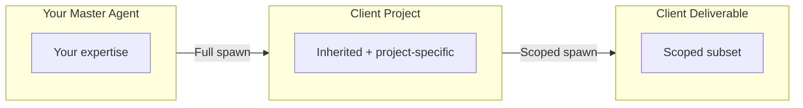

| Mode | Detection | Source |
|------|-----------|--------|
| **MASTER** | Has `templates/` folder | Full template library |
| **PROJECT** | No `templates/` folder | Inherits from parent's commands and knowledge |

**Delivery scenarios:**

| Scenario | Approach |
|----------|----------|
| Client needs full control | Deliver the complete project |
| Client needs limited scope | Spawn a subset with specific capabilities |
| Client is technical | Include `/spawn-project` so they can extend |
| Client is non-technical | Scope down to essential commands only |

Each level can add or modify content before spawning the next generation.

### Onboarding Existing Projects

Already have a codebase? Tasks guide the agent through discovery and documentation.


The agent explores structure, identifies patterns, and documents findings. You review, correct, and add context. Knowledge compounds in `CLAUDE.md` over time.

---

## Your Expertise, Continuously Improving

Knowledge flows both ways. Learnings from client work improve your master agent. Improvements to your master agent flow down to active projects.

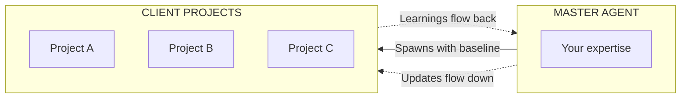

| Direction | Mechanism | What Flows |
|-----------|-----------|------------|
| **Down** | `/start-session` checks `inbox/updates/` | New commands, improved knowledge, bug fixes |
| **Up** | `/end-session` generates feedback | Patterns discovered, gotchas, new techniques |

**Template sync** keeps your knowledge base current. Improve commands in `.claude/commands/` (your staging area), test them in real engagements, then run `/sync-templates` to propagate changes to `templates/`. Export updates to active client projects via `/end-session`. **[Template Sync Workflow →](docs/template-sync-workflow.md)**

---

## Code Session Workflow

Every coding session follows the same flow — and every spawned project inherits it.

```mermaid
flowchart TD
    A["Open coding agent"] --> B["/start-session"]
    B --> C{"SETUP.md exists?"}
    C -->|"Yes"| D["Run setup or archive"]
    C -->|"No"| E{"On protected branch?"}
    D --> E
    E -->|"Yes"| F["Check inbox"]
    E -->|"No"| J{"Handover exists?"}
    F --> G{"Feedback/updates?"}
    G -->|"Yes"| H["Process or skip"]
    G -->|"No"| I["⚠️ Create branch first"]
    H --> I
    I --> K["Show session note"]
    J -->|"Yes"| L["Display handover"]
    J -->|"No"| M["✓ Safe to work"]
    L --> M
    M --> K
    K --> N["Ready to work"]
```

### The Work Loop

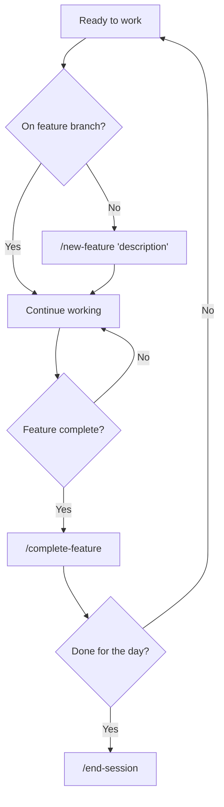

### Handover Documents

When ending a session on a feature branch, `/end-session` offers to create a handover document in `outbox/handovers/`. Next time anyone starts a session on that branch, `/start-session` displays the handover automatically.

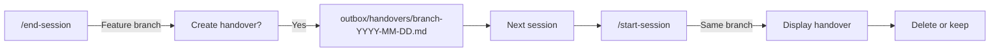

Protected branches (`main`, `master`, `develop`, `release/*`) trigger feedback/update checks — you're about to start something new. Feature branches check for handovers first, then go straight to work.

### What `/end-session` Captures

When you finish working, `/end-session` wraps up your session and captures everything for next time:

| Captured | Location | Purpose |
|----------|----------|---------|
| **Session log** | `.project/sessions/YYYY-MM-DD.md` | Timestamped work summary for `/summary` reports |
| **Token usage** | `.project/token-usage.md` | Cost tracking (input, output, cache stats) |
| **Learnings** | `LEARNINGS.md` | Patterns discovered, gotchas encountered |
| **Tool intelligence** | `.project/tool-intelligence.md` | Which tools worked well for which tasks |
| **Session note** | `.project/session-note.md` | Handoff context for next `/start-session` |

The command also:
- Updates `CLAUDE.md` with any new project patterns (via `claude-md-management` skill)
- Generates agent feedback for sending back to master agent
- Commits changes with your approval

Each session compounds on the last — the agent gets smarter about your project over time.

### Extra Commands

| Command | Purpose |
|---------|---------|
| `/commit` | Quick commit with approval during work |
| `/clean-branches` | Remove merged or stale branches |
| `/summary` | Generate accomplishments report from session logs |

**[Full Workflow Details →](templates/workflows/Session-Git-Workflow.md)**

---

## Tools & Integrations

Squared Agent works with 40+ tools organized across four categories.

### Agent Skills

[Agent Skills](https://agentskills.io/home) is an open standard (originally developed by Anthropic) for giving AI agents new capabilities. Skills are folders containing instructions, scripts, and resources that agents discover and use to perform tasks more accurately.

```
/add-skill anthropics/skills
```

Spawned projects are told which skills to install based on their technology stack. Skills are installed during setup via `npx add-skill`.

#### Installed Skills

| Skill | Purpose | Source |
|-------|---------|--------|
| **better-auth-best-practices** | Integration guide for Better Auth framework | better-auth/skills |
| **vercel-react-best-practices** | React/Next.js performance optimization (45 rules from Vercel) | vercel-labs/agent-skills |
| **web-design-guidelines** | UI code review for accessibility, UX, design compliance | vercel-labs/agent-skills |
| **agent-browser** | Browser automation patterns for testing and interaction | local |

#### Recommended Skills

| Skill | Purpose | Category |
|-------|---------|----------|
| **frontend-design** | Production-grade UI without generic AI aesthetics | web |
| **webapp-testing** | End-to-end web application testing | web |
| **turborepo** | Comprehensive patterns, caching, CI/CD, and anti-patterns | monorepo |
| **mcp-builder** | Create MCP servers for tool integration | patterns |
| **docx** | Word document creation and editing | patterns |
| **pptx** | PowerPoint presentation creation | patterns |
| **xlsx** | Excel spreadsheet manipulation | patterns |
| **pdf** | PDF document handling | patterns |

#### How Skills Work

| Step | What Happens |
|------|--------------|
| **Catalogue** | `/add-skill [source]` runs `npx add-skill` and updates `templates/skills/skill-mapping.json` |
| **Recommend** | `/spawn-project` lists recommended skills based on knowledge categories |
| **Install** | Spawned agent runs `npx add-skill anthropics/skills -s [skill]` during setup |

> **Note:** Skills are different from Claude Code plugins. Skills are portable across any agent that supports the [Agent Skills spec](https://agentskills.io/home) (Cursor, VS Code, Claude Code, Gemini CLI, etc.).

**[Skills reference →](templates/skills/README.md)**

### MCP Servers via Toolhive

We recommend [Toolhive](https://github.com/stacklok/toolhive) for managing MCP servers. Here are the plugins we suggest configuring:

| Server | Key Tools | Purpose |
|--------|-----------|---------|
| **GitHub** | `search_repositories`, `search_code`, `list_issues`, `create_issue` | GitHub API integration |
| **Perplexity** | `perplexity_research`, `perplexity_ask`, `perplexity_reason` | AI-powered web search |
| **FireCrawl** | `firecrawl_scrape`, `firecrawl_crawl`, `firecrawl_map` | Web scraping and crawling |
| **ShadCN** | `get_component`, `list_components` | UI component library |
| **Context7** | `resolve-library-id`, `query-docs` | Live documentation lookup |
| **DataForSeo** | SEO analysis, keyword research | Search engine optimization |
| **n8n** | Workflow automation | No-code automation |
| **Playwright** | Browser automation, screenshots | E2E testing |

> **MCP (Model Context Protocol)**: A standard for connecting AI models to external tools and services. Think of it as plugins for Claude.

### Claude Code Plugins

Pre-configured plugins that add specialized capabilities:

| Plugin | Command | What It Does |
|--------|---------|--------------|
| **feature-dev** | `/feature-dev` | Architecture-first feature planning with code-explorer, code-architect, and code-reviewer agents |
| **ralph-loop** | `/ralph-loop` | Autonomous implement → test → iterate loop until task is complete |
| **frontend-design** | `/frontend-design` | Production-grade UI that avoids generic AI aesthetics |
| **superpowers** | — | Powers `/new-feature`, `/complete-feature`, `/spawn-project`, `/get-feedback`, `/end-session` with brainstorming, git worktrees, and verification |
| **commit-commands** | — | Powers `/commit` and `/clean-branches` with standardized git operations |
| **claude-md-management** | — | Powers `/end-session` with CLAUDE.md revision capabilities |
| **stripe** | `/stripe-*` | Stripe integration guides, test cards, error explanations |
| **code-simplifier** | — | Refines code for clarity while preserving functionality |
| **context7** | — | Fetches up-to-date library documentation |
| **security-guidance** | — | Security best practices for code analysis |
| **toolhive-mcp-optimizer** | — | Optimizes Toolhive MCP server configurations |

### Browser Automation

Via `claude-in-chrome` MCP server:

| Tool | Purpose |
|------|---------|
| `tabs_context_mcp` | Get available browser tabs |
| `read_page` | Accessibility tree of page elements |
| `find` | Natural language element search |
| `form_input` | Fill form fields |
| `navigate` | Go to URLs, back/forward |
| `computer` | Click, type, scroll, screenshot |

### Core Tools

Built into Claude Code:

| Tool | Purpose |
|------|---------|
| `Glob` | Fast file pattern matching |
| `Grep` | Content search with regex |
| `Read` | Read files (including images, PDFs) |
| `Write` | Create new files |
| `Edit` | Modify existing files |
| `Bash` | Run terminal commands |
| `Task` | Launch specialized agents |

---

## Token Tracking

Built-in cost visibility for every session. Know what you're spending.

| Command | What It Does |
|---------|--------------|
| `/end-session` | Captures token usage from Claude Code session files |
| `/summary` | Calculates costs and tracks against subscription limits |

Track input/output tokens, cache efficiency, and billing type (`subscription` vs `api`). Configure your plan's daily/hourly limits to see utilization percentages and get tier recommendations.

**[Full details →](#token-usage--cost-tracking)**

---

## MCP Security Model

Credentials never leak between projects. Squared Agent uses a three-layer separation:

```mermaid
flowchart TB
    subgraph Global["🔐 GLOBAL (~/.claude/)"]
        G1["MCP credentials"]
        G2["API keys (env vars)"]
        G3["Toolhive config"]
    end

    subgraph Project["📁 PROJECT (.claude/)"]
        P1["settings.json"]
        P2["Plugins"]
        P3["Permissions"]
        P4["commands/"]
    end

    subgraph Local["👤 LOCAL (.project/)"]
        L1["tool-intelligence.md"]
        L2["sessions/"]
        L3["session-note.md"]
    end

    Global -.->|"Referenced, not copied"| Project
    Project -->|"Committed to git"| Repo["Git Repository"]
    Local -->|"Gitignored"| User["Your Machine Only"]
```

| Layer | Location | Contains | In Git? |
|-------|----------|----------|---------|
| **Global** | `~/.claude/` | MCP credentials, API keys | No |
| **Project** | `.claude/` | Plugins, permissions, commands | Yes |
| **Local** | `.project/` | Tool intelligence, session logs | No |

### Why This Matters

- **Templates are credential-free**: Copy setup packages without exposing secrets
- **Each project is isolated**: Tool intelligence learned in one project stays there
- **MCP servers via environment**: Credentials live in your shell, not in code

---

## Tool Intelligence

The agent learns which tools work best for which tasks — and keeps a work log for reporting.

```mermaid
flowchart TB
    subgraph Session["DURING SESSION"]
        A["/start-session"] -->|"Loads"| B["tool-intelligence.md"]
        A -->|"Reads"| C["session-note.md"]
        B --> D["Work with optimal tools"]
        C --> D
    end

    subgraph EndSession["/end-session"]
        D --> E["Capture session"]
        E --> F["📝 Session log<br/>(local, not in repo)"]
        E --> G["🧠 Tool intelligence<br/>(local, not in repo)"]
        E --> H["📋 Session note<br/>(local, not in repo)"]
    end

    subgraph Reporting["/summary"]
        F -->|"Reads logs"| I["Generate report"]
        I --> J["Today / Week / Month"]
        J --> K["📊 Accomplishments<br/>ready to share"]
    end
```

### What Gets Captured

| Output | Location | In Repo? | Purpose |
|--------|----------|----------|---------|
| **Session logs** | `.project/sessions/` | No (gitignored) | Timestamped work history + token usage |
| **Tool intelligence** | `.project/tool-intelligence.md` | No (gitignored) | Learned shortcuts and patterns |
| **Token usage** | `.project/token-usage.md` | No (gitignored) | Cumulative cost tracking |
| **Session note** | `.project/session-note.md` | No (gitignored) | Task handoff for next session |

### What Tool Intelligence Tracks

- **Toolhive shortcuts**: Which MCP servers you use most
- **Plugin patterns**: How `/feature-dev` uses `/ralph-loop` where appropriate
- **Browser tips**: Effective `claude-in-chrome` patterns
- **Core efficiency**: When to use Task agents vs direct tools

### Token Usage & Cost Tracking

Every session captures raw token usage from Claude Code:

| Metric | Description |
|--------|-------------|
| **Billing type** | `subscription` (Claude Code plan) or `api` (background agents) |
| **Input tokens** | Tokens in your prompts |
| **Output tokens** | Tokens in Claude's responses |
| **Cache read** | Tokens retrieved from cache (cheaper) |
| **Cache creation** | Tokens added to cache |

Costs and limits are calculated at report time:
- **Subscription sessions**: Tracked against your configured daily/hourly limits to assess tier needs
- **API sessions**: Charged per token (estimated in `/summary` reports)

Configure your subscription limits in `.project/token-usage.md` to track usage against your plan's daily and hourly caps. `/summary` will show % utilization and recommend tier changes if you're frequently hitting limits.

### Reporting with `/summary`

Generate accomplishments reports from your session logs:

```
/summary today      # What you did today
/summary week       # This week's work
/summary month      # Monthly accomplishments
```

Output includes:
- Categorized git commits (features, fixes, refactors, etc.)
- Session highlights from logs
- **Token usage** by billing type (subscription vs API)
- **Subscription limit analysis** with % utilization and tier recommendations
- **Estimated API costs** calculated at report time with current pricing
- Cache efficiency percentage

Copy-paste ready for standups, status updates, or client reports.

### How It Works

1. `/start-session` loads tool preferences and previous session note
2. Claude proactively selects appropriate tools without you asking
3. `/end-session` saves session log + updates tool intelligence + leaves note for next time
4. `/summary` pulls from session logs to generate reports
5. Each session starts smarter than the last

All data stays local in `.project/` (gitignored). Personal to each user, compounds over time.

---

## Commands Reference

### Session & Git

| Command | Description |
|---------|-------------|
| `/start-session` | Begin session with first-run setup, branch awareness, and context loading |
| `/new-feature "desc"` | Create feature branch (or worktree) for safe development |
| `/complete-feature` | Wrap up feature branch — merge or create PR |
| `/clean-branches` | Remove merged or stale feature branches |
| `/end-session` | End session, update docs, capture learnings, commit |
| `/commit` | Draft commit message, get approval, commit |

### Ideation

| Command | Description |
|---------|-------------|
| `/discuss` | Exploratory conversation → discussion document for `/new-feature` or `/spawn-project` |

### Project Creation

| Command | Description |
|---------|-------------|
| `/spawn-project` | Create new project via discovery conversation or template selection |

### Utilities

| Command | Description |
|---------|-------------|
| `/summary` | Generate accomplishments report from git history |
| `/vibekanban` | Launch VibeKanban for AI agent task management |
| `/local-env` | Manage local dev environment (domains, HTTPS, proxy) |
| `/agent-feedback` | Generate feedback to send back to master agent — **[How feedback works →](docs/feedback.md)** |
| `/how-to-use` | Display the human-editable guide |
| `/list-tools` | List all commands, plugins, and tools |
| `/get-feedback` | Process inbox and implement improvements |
| `/add-skill` | Install and catalogue skills for spawned projects |
| `/sync-templates` | Sync active commands to template files |
| `/sync-docs` | Synchronize documentation terminology and patterns |

---

## Project Structure

```
apps/                   # Full applications
  web/
    dashboard/          # Work summary & session costs viewer
  api/                  # API services (REST, GraphQL, tRPC)
  workers/              # Background workers (queues, cron)
  ai/                   # AI apps (agents, pipelines)

packages/               # Publishable npm packages
  core/                 # @squared-agent/core - shared utilities
  cli/                  # @squared-agent/cli - CLI tool
  create-project/       # create-squared-agent - npm create

templates/              # Content copied to new projects
  workflows/            # Development processes (Session-Git-Workflow)
  commands/             # Command implementation guides
  knowledge/            # Framework guides (Next.js, etc.)
  skills/               # Skills (Agent Skills spec)
  ux-guides/            # UI/UX patterns
  profiles/             # Setup profiles (developer/, etc.)
  tasks/                # One-time setup tasks

inbox/                  # Ideas and feedback for improvements
  ideas/                # Your ideas to discuss
  feedback/             # Feedback from spawned projects

suggestions/            # Agent proposals (categorized)
  knowledge/            # Proposed new guides
  commands/             # Proposed command improvements
  workflow/             # Proposed workflow changes
  other/                # Miscellaneous improvements

knowledge/              # Accumulated learnings
  archive/              # Processed feedback files

outbox/                 # Generated project packages (from /spawn-project)
  feedback/             # Generated feedback files (from /agent-feedback)
  discussions/          # Discussion documents (from /discuss)
  handovers/            # Handover documents for feature branches (from /end-session)
docs/                   # Documentation
.claude/                # Claude Code configuration
  commands/             # Active commands
  skills/               # Installed agent skills

.project/               # Local data (gitignored)
  sessions/             # Session logs by date
  tool-intelligence.md  # Learned tool preferences
  token-usage.md        # Cumulative token stats
```

---

## Continuous Improvement

Knowledge cycles between your master agent and client projects — in both directions.

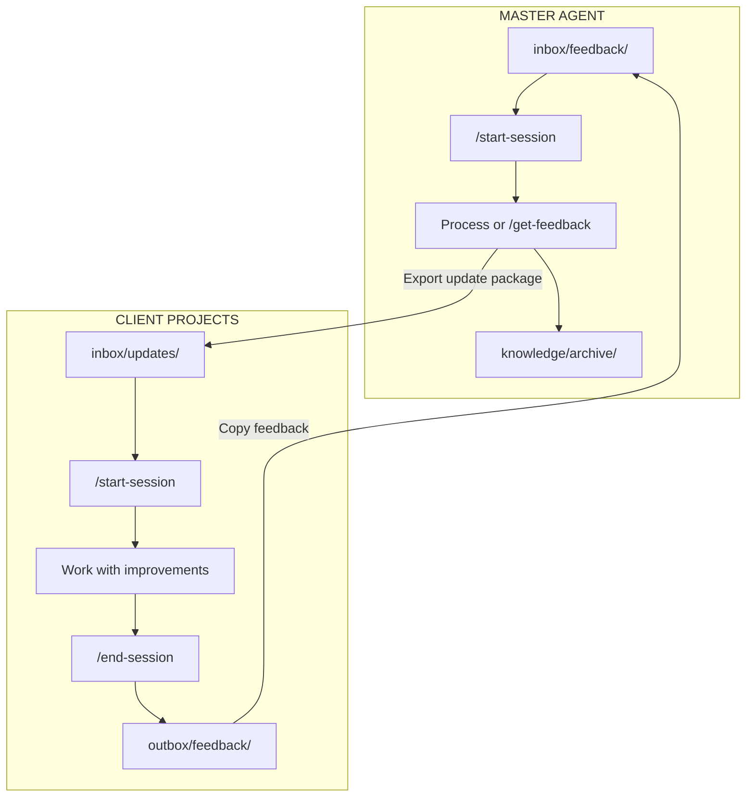

### Learnings Flow Up

1. **During client work**: `/end-session` captures patterns, gotchas, new techniques
2. **Generate feedback**: `/agent-feedback` packages learnings to `outbox/feedback/`
3. **Copy to master**: Save in `inbox/feedback/`
4. **Process & implement**: `/start-session` detects feedback and offers to process inline

### Updates Flow Down

1. **Improve master**: Fix bugs, add commands, enhance knowledge
2. **Export updates**: `/end-session` offers to create update package
3. **Deliver to projects**: Copy to client project's `inbox/updates/`
4. **Apply on next session**: `/start-session` detects and offers to apply updates

Active client projects stay current. Past learnings compound into future work.

---

## Documentation

| Document | What's Inside |
|----------|---------------|
| [templates/README.md](templates/README.md) | Full templates reference — workflows, profiles, knowledge, commands, tasks |
| [docs/workflow.md](docs/workflow.md) | Development workflow and best practices |
| [docs/commands.md](docs/commands.md) | Full command documentation |
| [docs/plugins.md](docs/plugins.md) | Plugin configuration details |
| [docs/content.md](docs/content.md) | Available profiles, knowledge, and tasks |
| [docs/feedback.md](docs/feedback.md) | Agent feedback system — how learnings flow back (all local files, nothing sent anywhere) |
| [docs/how-to-use.md](docs/how-to-use.md) | Human-editable quick start guide |

---

## Development

This repository is a hybrid documentation hub + development monorepo using pnpm and Turborepo.

### Setup

```bash
pnpm install    # Install dependencies
pnpm build      # Build all packages
pnpm dev        # Watch mode
```

### Available Packages

| Package | Description |
|---------|-------------|
| `@squared-agent/core` | Shared utilities, types, constants |
| `@squared-agent/cli` | CLI for project bootstrapping |
| `create-squared-agent` | `npm create squared-agent` scaffolding |
| `@squared-agent/dashboard` | Work summary & session costs dashboard |

### Running the Dashboard

```bash
pnpm --filter @squared-agent/dashboard dev
```

Opens at `http://localhost:5173`. Add projects by path to view their session logs and token costs.

### Publishing

```bash
pnpm changeset        # Create changeset
pnpm version-packages # Bump versions
pnpm publish-packages # Publish to npm
```

---

## License

Private — Squared Lemons
