# Squared Agent

**Bootstrap new projects with Claude Code. Ship faster with built-in workflows.**

Stop spending the first hour of every project configuring tools, setting up git workflows, and remembering which commands work best. Squared Agent packages everything you need — session management, branch protection, tool intelligence, and platform-specific guides — into a single setup you copy to new or existing projects.

```mermaid
flowchart LR
    A["You: 'I want to build X'"] --> B["Squared Agent"]
    B --> C["📦 Setup Package"]
    C --> D["New Project"]
    D --> E["✅ Ready to build"]
```



---

## The Problem

Every new project starts with the same friction:

| Problem | What Happens |
|---------|--------------|
| **Manual setup** | Spend 30+ minutes configuring Claude Code, plugins, permissions, and commands |
| **Messy main branches** | Accidental commits to main → merge conflicts → lost work |
| **Credential leakage** | MCP API keys accidentally committed or shared between projects |
| **Lost learnings** | Discover a great tool shortcut, forget it by next project |
| **No workflow** | Every session starts cold — no context, no plan |
| **No cost visibility** | Token usage scattered across sessions → no idea what you're spending |

Squared Agent solves all of these.

---

## Quick Start

### 1. Get the Agent

```bash
git clone https://github.com/squared-lemons/squared-agent.git
cd squared-agent
```

### 2. Open with Claude Code

```bash
claude .
```

### 3. Start a New Idea

```
/new-idea
```

Have a discovery conversation:
- Describe what you want to build
- Discuss requirements and platform options
- Make technical decisions together
- Claude generates a complete project package

### 4. Copy to Your Project

A folder opens with your setup package. Copy its contents to your new project folder.

### 5. Run the Setup

In your new project folder:

```bash
claude .
```

Tell Claude: "Read SETUP.md and help me set up this project"

The agent handles the rest — configures plugins, creates commands, sets up permissions, and gets you ready to build.

---

## Agent Packages

Two ways to create setup packages for new projects:

### `/new-idea` — Discovery Conversation

Best for new projects where you're still figuring out requirements.

```mermaid
flowchart LR
    A["Describe your idea"] --> B["Discuss requirements"]
    B --> C["Make technical decisions"]
    C --> D["📦 Complete package"]
```



The conversation covers:
- What you're building and who it's for
- Platform options (web, mobile, desktop)
- Technical decisions with tradeoffs explained
- Scope for v1 vs future features

**Output:** `PROJECT-BRIEF.md`, `TECHNICAL-DECISIONS.md`, `SETUP.md`, plus relevant knowledge and commands.

### `/prepare-setup` — Component Selection

Best when you know what you need and want to pick specific components.

```mermaid
flowchart LR
    A["Select profile"] --> B["Choose knowledge"]
    B --> C["Pick commands"]
    C --> D["📦 Custom package"]
```



Select from:
- **Profiles** — Base configurations (developer workflow, permissions, hooks)
- **Knowledge** — Platform guides (Next.js, etc.)
- **Commands** — Workflow guides (end-session, new-feature, etc.)
- **Tasks** — One-time setup activities (codebase investigation)

**[Full templates reference →](templates/README.md)**

### Bringing the Agent into Existing Projects

Already have a codebase? Tasks are included to guide the agent through discovery and documentation.

The agent explores your project structure, identifies patterns, and documents what it finds — leaving you to fill in the blanks and teach it about your existing systems. You review its findings, correct assumptions, and add context only you know.


This collaborative onboarding means the agent gets productive faster, and your project knowledge lives in `CLAUDE.md` where it compounds over time.

---

# Projects That Follow Your Best Practices

Everything below defines the baseline every spawned project receives. Squared Agent runs this setup, then the new project evolves independently — building its own tool intelligence, capturing its own learnings, and feeding improvements back.

```mermaid
flowchart LR
    subgraph SA["SQUARED AGENT"]
        A["templates/"]
    end

    SA -->|"Copies baseline"| B["📦 New Project"]
    B --> C["Project evolves"]
    C --> D["Learnings & feedback"]
    D -.->|"Improvements flow back"| SA
```



**Template sync** keeps your commands evolving safely. Improve commands in `.claude/commands/` (your staging area), test them in daily use, then run `/sync-templates` to propagate changes to `templates/`. Future spawned projects automatically inherit your tested improvements. **[Template Sync Workflow →](docs/template-sync-workflow.md)**

---

## Session Git Workflow

**This agent uses the [Session Git Workflow](templates/workflows/Session-Git-Workflow.md)** — and so does every project it spawns.

| Command | When to Use |
|---------|-------------|
| `/start-session` | Beginning of work — checks branch safety, loads context |
| `/new-feature "desc"` | Starting new work — creates feature branch or worktree |
| `/commit` | During work — quick commit with approval |
| `/complete-feature` | Feature is done — merge to main or create PR |
| `/clean-branches` | Periodic maintenance — remove merged or stale branches |
| `/end-session` | Done for now — update docs, capture learnings, commit |

Protected branches (`main`, `master`, `develop`, `release/*`) block direct changes and guide you to create a feature branch first.

**Token tracking** is built in — `/end-session` captures usage, `/summary` calculates costs. Track spending against subscription limits and know when to upgrade or optimize.

**[Full Session Git Workflow →](templates/workflows/Session-Git-Workflow.md)**

---

## Tools & Integrations

Squared Agent works with 40+ tools organized across four categories.

### Agent Skills

[Agent Skills](https://agentskills.io/home) is an open standard (originally developed by Anthropic) for giving AI agents new capabilities. Skills are folders containing instructions, scripts, and resources that agents discover and use to perform tasks more accurately.

```
/add-skill anthropics/skills
```

Spawned projects are told which skills to install based on their technology stack. Skills are installed during setup via `npx add-skill`.

#### Installed Skills

| Skill | Purpose | Source |
|-------|---------|--------|
| **create-auth** | Guide for adding Better Auth to TypeScript/JavaScript apps | better-auth/skills |
| **better-auth-best-practices** | Integration guide for Better Auth framework | better-auth/skills |
| **vercel-react-best-practices** | React/Next.js performance optimization (45 rules from Vercel) | vercel-labs/agent-skills |
| **web-design-guidelines** | UI code review for accessibility, UX, design compliance | vercel-labs/agent-skills |

#### Recommended Skills

| Skill | Purpose | Category |
|-------|---------|----------|
| **frontend-design** | Production-grade UI without generic AI aesthetics | web |
| **webapp-testing** | End-to-end web application testing | web |
| **mcp-builder** | Create MCP servers for tool integration | patterns |
| **docx** | Word document creation and editing | patterns |
| **pptx** | PowerPoint presentation creation | patterns |
| **xlsx** | Excel spreadsheet manipulation | patterns |
| **pdf** | PDF document handling | patterns |

#### How Skills Work

| Step | What Happens |
|------|--------------|
| **Catalogue** | `/add-skill [source]` runs `npx add-skill` and updates `templates/skills/skill-mapping.json` |
| **Recommend** | `/prepare-setup` and `/new-idea` list recommended skills based on knowledge categories |
| **Install** | Spawned agent runs `npx add-skill anthropics/skills -s [skill]` during setup |

> **Note:** Skills are different from Claude Code plugins. Skills are portable across any agent that supports the [Agent Skills spec](https://agentskills.io/home) (Cursor, VS Code, Claude Code, Gemini CLI, etc.).

**[Skills reference →](templates/skills/README.md)**

### MCP Servers via Toolhive

We recommend [Toolhive](https://github.com/stacklok/toolhive) for managing MCP servers. Here are the plugins we suggest configuring:

| Server | Key Tools | Purpose |
|--------|-----------|---------|
| **GitHub** | `search_repositories`, `search_code`, `list_issues`, `create_issue` | GitHub API integration |
| **Perplexity** | `perplexity_research`, `perplexity_ask`, `perplexity_reason` | AI-powered web search |
| **FireCrawl** | `firecrawl_scrape`, `firecrawl_crawl`, `firecrawl_map` | Web scraping and crawling |
| **ShadCN** | `get_component`, `list_components` | UI component library |
| **Context7** | `resolve-library-id`, `query-docs` | Live documentation lookup |
| **DataForSeo** | SEO analysis, keyword research | Search engine optimization |
| **n8n** | Workflow automation | No-code automation |
| **Playwright** | Browser automation, screenshots | E2E testing |

> **MCP (Model Context Protocol)**: A standard for connecting AI models to external tools and services. Think of it as plugins for Claude.

### Claude Code Plugins

Pre-configured plugins that add specialized capabilities:

| Plugin | Command | What It Does |
|--------|---------|--------------|
| **feature-dev** | `/feature-dev` | Architecture-first feature planning with code-explorer, code-architect, and code-reviewer agents |
| **ralph-loop** | `/ralph-loop` | Autonomous implement → test → iterate loop until task is complete |
| **frontend-design** | `/frontend-design` | Production-grade UI that avoids generic AI aesthetics |
| **code-simplifier** | — | Refines code for clarity while preserving functionality |
| **context7** | — | Fetches up-to-date library documentation |
| **playwright** | — | Browser automation and visual testing |

### Browser Automation

Via `claude-in-chrome` MCP server:

| Tool | Purpose |
|------|---------|
| `tabs_context_mcp` | Get available browser tabs |
| `read_page` | Accessibility tree of page elements |
| `find` | Natural language element search |
| `form_input` | Fill form fields |
| `navigate` | Go to URLs, back/forward |
| `computer` | Click, type, scroll, screenshot |

### Core Tools

Built into Claude Code:

| Tool | Purpose |
|------|---------|
| `Glob` | Fast file pattern matching |
| `Grep` | Content search with regex |
| `Read` | Read files (including images, PDFs) |
| `Write` | Create new files |
| `Edit` | Modify existing files |
| `Bash` | Run terminal commands |
| `Task` | Launch specialized agents |

---

## Token Tracking

Built-in cost visibility for every session. Know what you're spending.

| Command | What It Does |
|---------|--------------|
| `/end-session` | Captures token usage from Claude Code session files |
| `/summary` | Calculates costs and tracks against subscription limits |

Track input/output tokens, cache efficiency, and billing type (`subscription` vs `api`). Configure your plan's daily/hourly limits to see utilization percentages and get tier recommendations.

**[Full details →](#token-usage--cost-tracking)**

---

## MCP Security Model

Credentials never leak between projects. Squared Agent uses a three-layer separation:

```mermaid
flowchart TB
    subgraph Global["🔐 GLOBAL (~/.claude/)"]
        G1["MCP credentials"]
        G2["API keys (env vars)"]
        G3["Toolhive config"]
    end

    subgraph Project["📁 PROJECT (.claude/)"]
        P1["settings.json"]
        P2["Plugins"]
        P3["Permissions"]
        P4["commands/"]
    end

    subgraph Local["👤 LOCAL (.project/)"]
        L1["tool-intelligence.md"]
        L2["sessions/"]
        L3["session-note.md"]
    end

    Global -.->|"Referenced, not copied"| Project
    Project -->|"Committed to git"| Repo["Git Repository"]
    Local -->|"Gitignored"| User["Your Machine Only"]
```



| Layer | Location | Contains | In Git? |
|-------|----------|----------|---------|
| **Global** | `~/.claude/` | MCP credentials, API keys | No |
| **Project** | `.claude/` | Plugins, permissions, commands | Yes |
| **Local** | `.project/` | Tool intelligence, session logs | No |

### Why This Matters

- **Templates are credential-free**: Copy setup packages without exposing secrets
- **Each project is isolated**: Tool intelligence learned in one project stays there
- **MCP servers via environment**: Credentials live in your shell, not in code

---

## Tool Intelligence

The agent learns which tools work best for which tasks — and keeps a work log for reporting.

```mermaid
flowchart TB
    subgraph Session["DURING SESSION"]
        A["/start-session"] -->|"Loads"| B["tool-intelligence.md"]
        A -->|"Reads"| C["session-note.md"]
        B --> D["Work with optimal tools"]
        C --> D
    end

    subgraph EndSession["/end-session"]
        D --> E["Capture session"]
        E --> F["📝 Session log<br/>(local, not in repo)"]
        E --> G["🧠 Tool intelligence<br/>(local, not in repo)"]
        E --> H["📋 Session note<br/>(local, not in repo)"]
    end

    subgraph Reporting["/summary"]
        F -->|"Reads logs"| I["Generate report"]
        I --> J["Today / Week / Month"]
        J --> K["📊 Accomplishments<br/>ready to share"]
    end
```



### What Gets Captured

| Output | Location | In Repo? | Purpose |
|--------|----------|----------|---------|
| **Session logs** | `.project/sessions/` | No (gitignored) | Timestamped work history + token usage |
| **Tool intelligence** | `.project/tool-intelligence.md` | No (gitignored) | Learned shortcuts and patterns |
| **Token usage** | `.project/token-usage.md` | No (gitignored) | Cumulative cost tracking |
| **Session note** | `.project/session-note.md` | No (gitignored) | Task handoff for next session |

### What Tool Intelligence Tracks

- **Toolhive shortcuts**: Which MCP servers you use most
- **Plugin patterns**: How `/feature-dev` uses `/ralph-loop` where appropriate
- **Browser tips**: Effective `claude-in-chrome` patterns
- **Core efficiency**: When to use Task agents vs direct tools

### Token Usage & Cost Tracking

Every session captures raw token usage from Claude Code:

| Metric | Description |
|--------|-------------|
| **Billing type** | `subscription` (Claude Code plan) or `api` (background agents) |
| **Input tokens** | Tokens in your prompts |
| **Output tokens** | Tokens in Claude's responses |
| **Cache read** | Tokens retrieved from cache (cheaper) |
| **Cache creation** | Tokens added to cache |

Costs and limits are calculated at report time:
- **Subscription sessions**: Tracked against your configured daily/hourly limits to assess tier needs
- **API sessions**: Charged per token (estimated in `/summary` reports)

Configure your subscription limits in `.project/token-usage.md` to track usage against your plan's daily and hourly caps. `/summary` will show % utilization and recommend tier changes if you're frequently hitting limits.

### Reporting with `/summary`

Generate accomplishments reports from your session logs:

```
/summary today      # What you did today
/summary week       # This week's work
/summary month      # Monthly accomplishments
```

Output includes:
- Categorized git commits (features, fixes, refactors, etc.)
- Session highlights from logs
- **Token usage** by billing type (subscription vs API)
- **Subscription limit analysis** with % utilization and tier recommendations
- **Estimated API costs** calculated at report time with current pricing
- Cache efficiency percentage

Copy-paste ready for standups, status updates, or client reports.

### How It Works

1. `/start-session` loads tool preferences and previous session note
2. Claude proactively selects appropriate tools without you asking
3. `/end-session` saves session log + updates tool intelligence + leaves note for next time
4. `/summary` pulls from session logs to generate reports
5. Each session starts smarter than the last

All data stays local in `.project/` (gitignored). Personal to each user, compounds over time.

---

## Commands Reference

### Session & Git

| Command | Description |
|---------|-------------|
| `/start-session` | Begin session with branch awareness and context loading |
| `/new-feature "desc"` | Create feature branch (or worktree) for safe development |
| `/complete-feature` | Wrap up feature branch — merge or create PR |
| `/clean-branches` | Remove merged or stale feature branches |
| `/end-session` | End session, update docs, capture learnings, commit |
| `/commit` | Draft commit message, get approval, commit |

### Project Creation

| Command | Description |
|---------|-------------|
| `/new-idea` | Discovery conversation → complete project package |
| `/prepare-setup` | Create generic setup package with selected components |

### Utilities

| Command | Description |
|---------|-------------|
| `/summary` | Generate accomplishments report from git history |
| `/how-to-use` | Display the human-editable guide |
| `/list-tools` | List all commands, plugins, and tools |
| `/get-feedback` | Process inbox and implement improvements |
| `/add-skill` | Install and catalogue skills for spawned projects |
| `/sync-templates` | Sync active commands to template files |
| `/sync-docs` | Synchronize documentation terminology and patterns |

---

## Project Structure

```
templates/              # Content copied to new projects
  commands/             # Command implementation guides
  knowledge/            # Framework guides (Next.js, etc.)
  skills/               # Skills (Vercel agent-skills)
  ux-guides/            # UI/UX patterns
  profiles/             # Setup profiles (developer/, etc.)
  tasks/                # One-time setup tasks

inbox/                  # Ideas and feedback for improvements
  ideas/                # Your ideas to discuss
  from-projects/        # Feedback from spawned projects

suggestions/            # Agent proposals (categorized)
  knowledge/            # Proposed new guides
  commands/             # Proposed command improvements
  workflow/             # Proposed workflow changes

docs/                   # Documentation
.claude/                # Claude Code configuration
  commands/             # Active commands

.project/               # Local data (gitignored)
  sessions/             # Session logs by date
  tool-intelligence.md  # Learned tool preferences
  token-usage.md        # Cumulative token stats
```

---

## Continuous Improvement

Every project you spawn can teach Squared Agent something new.


### The Feedback Loop

1. **During project work**: `/end-session` generates creator feedback
2. **Save feedback**: Copy it to `inbox/from-projects/` in this repo
3. **Process feedback**: Run `/get-feedback` to review and implement
4. **Templates improve**: Future projects benefit from past learnings

---

## Documentation

| Document | What's Inside |
|----------|---------------|
| [templates/README.md](templates/README.md) | Full templates reference — workflows, profiles, knowledge, commands, tasks |
| [docs/workflow.md](docs/workflow.md) | Development workflow and best practices |
| [docs/commands.md](docs/commands.md) | Full command documentation |
| [docs/plugins.md](docs/plugins.md) | Plugin configuration details |
| [docs/content.md](docs/content.md) | Available profiles, knowledge, and tasks |
| [docs/feedback.md](docs/feedback.md) | Creator feedback loop |
| [docs/how-to-use.md](docs/how-to-use.md) | Human-editable quick start guide |

---

## License

Private — Squared Lemons
