# Squared Agent

A Claude Code agent that bootstraps new projects. It packages up setup instructions, platform-specific guidance, and development workflows into folders you copy to new projects.

**The idea:** You describe what you want to build → Squared Agent creates a setup package → You copy it to a new folder → Claude Code reads the instructions and helps you build it.

---

## Quick Start

### 1. Get the Agent

```bash
git clone https://github.com/squared-lemons/squared-agent.git
cd squared-agent
```

Or download and extract the ZIP.

### 2. Open with Claude Code

```bash
claude .
```

### 3. Start a New Idea

```
/new-idea
```

Have a conversation:
- Describe what you want to build
- Discuss requirements and platform options
- Make technical decisions together
- Claude generates a complete project package

### 4. Copy to Your Project

A folder opens with your setup package. Copy its contents to your new project folder.

### 5. Run the Setup

In your new project folder:

```bash
claude .
```

Tell Claude: "Read SETUP.md and help me set up this project"

---

## How It Works

```mermaid
flowchart TB
    subgraph SA["SQUARED AGENT"]
        A["/new-idea"] --> B["Discovery conversation"]
        B --> C["Discuss requirements & platform"]
        C --> D["Make technical decisions"]
        D --> E["Generate project package"]
        E --> PKG["📦 Project Package<br/>• PROJECT-BRIEF.md<br/>• TECHNICAL-DECISIONS.md<br/>• SETUP.md<br/>• knowledge/<br/>• commands/"]
    end

    PKG -->|"Copy to new folder"| NP

    subgraph NP["YOUR NEW PROJECT"]
        F["Read SETUP.md"] --> G["Claude reads project brief"]
        G --> H["Understands WHY decisions were made"]
        H --> I["Enters plan mode"]
        I --> J["Builds version 1"]
        J --> K["✅ Working app!"]
    end
```



---

## Commands

### Session & Git
| Command | What it does |
|---------|--------------|
| `/start-session` | Begin session with branch awareness |
| `/new-feature` | Create feature branch (or worktree) |
| `/complete-feature` | Wrap up feature - merge or create PR |
| `/end-session` | End session, update docs, commit |
| `/commit` | Quick commit with approval |

### Project
| Command | What it does |
|---------|--------------|
| `/new-idea` | Discovery conversation → project package |
| `/prepare-setup` | Create generic setup package |
| `/summary` | Generate accomplishments report |
| `/how-to-use` | Quick start guide |
| `/list-tools` | List all commands, plugins, and tools |
| `/get-feedback` | Process inbox and implement improvements |

---

## Documentation

| Doc | What's in it |
|-----|--------------|
| [docs/workflow.md](docs/workflow.md) | Development workflow and best practices |
| [docs/commands.md](docs/commands.md) | Full command documentation |
| [docs/plugins.md](docs/plugins.md) | Plugins and configuration details |
| [docs/content.md](docs/content.md) | Available profiles, knowledge, and tasks |
| [docs/feedback.md](docs/feedback.md) | Creator feedback loop |

---

## Project Structure

```
templates/          # Content copied to new projects
  commands/         # Command implementation guides
  knowledge/        # Framework guides
  ux-guides/        # UI/UX patterns
  profiles/         # Setup profiles
  tasks/            # One-time setup tasks
inbox/              # Ideas and feedback for improvements
suggestions/        # Agent proposals for improvements
docs/               # Documentation
.claude/            # Claude Code configuration
  commands/         # Active slash commands
```

---

## Continuous Improvement


When you run `/end-session` in a spawned project, it generates feedback. Save that feedback to `inbox/from-projects/` in this repo to help improve templates.

---

## License

Private - Squared Lemons
