# From Idea to Architecture: A Discovery Conversation with your code agent

How a 15-minute conversation turned a feature list into a complete technical design.

---

## The Starting Point

I had a [markdown file](Project-Scope.md) on my desktop — a feature list for a gym management system. Member tracking, QR check-ins, class bookings, personal training, payments. The usual SaaS feature dump.

The document described *what* the system should do, but not *how* to build it. That's where the discovery conversation comes in.

---

## Starting the Conversation

I used your code agent's `/spawn-project` command, passing my scope document as context:

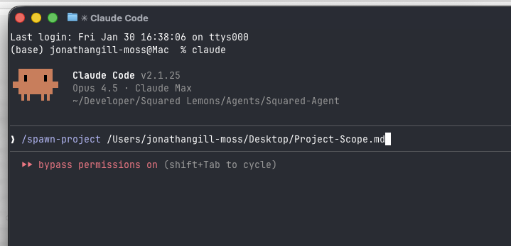

The agent read my document, summarised what it understood, and immediately asked the first strategic question.

---

## Question 1: Launch Strategy

**Why this question matters:** The scope document mentioned "multiple gym locations under one business" — multi-tenant architecture. But multi-tenancy adds significant complexity to every part of the system: data isolation, authentication, billing, permissions.

The agent presented three options:
1. **MVP for one gym first** — Validate core workflows, add multi-tenancy later
2. **Multi-tenant from day one** — Full business → gyms → members hierarchy ready to go
3. **White-label platform** — Each gym gets their own branded experience

I chose **Option 1** — starting with a single gym keeps the data model simple while we nail the core experience. The agent acknowledged this trades immediate scale for faster validation.

---

## Question 2: Payment Handling

**Why this question matters:** Payments are one of the highest-complexity features in any SaaS. Stripe webhooks, failed payment handling, refunds, tax calculations — each adds development time and edge cases.

Options presented:
1. **Stripe subscriptions** — Members pay directly through the app
2. **Record-keeping only** — Gym handles payments externally, app just tracks
3. **Hybrid** — Support both online payments and manual recording

The agent recommended Option 2 for MVP — most gym owners already have payment systems. But I chose **Option 1** because I wanted a complete product where members can sign up and pay directly. The agent noted this means handling webhooks and subscription lifecycle carefully.

---

## Question 3: QR Code Check-ins

**Why this question matters:** The check-in experience affects hardware requirements, development complexity, and daily operations. Getting this wrong means friction at the gym entrance every single day.

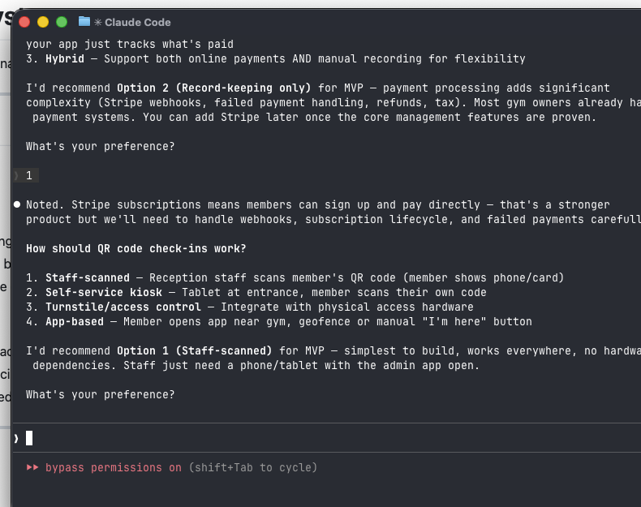

Options:
1. **Staff-scanned** — Reception staff scans member's QR code
2. **Self-service kiosk** — Tablet at entrance
3. **Turnstile/access control** — Integrate with physical hardware
4. **App-based** — Geofence or manual "I'm here" button

I chose **Option 1** — simplest to build, works everywhere, no hardware dependencies. Staff just need a phone or tablet with the admin app open.

---

## Question 4: Class Bookings

**Why this question matters:** Gyms run different types of classes. A yoga class with 15 mats needs booking. A weights floor "class" might just need attendance tracking. Building the wrong model means either over-engineering or missing real needs.

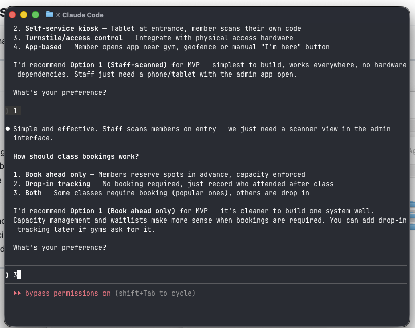

Options:
1. **Book ahead only** — Members reserve spots, capacity enforced
2. **Drop-in tracking** — No booking, just record attendance after
3. **Both** — Some classes require booking, others are drop-in

I chose **Option 3** — yoga classes need booking (limited mats), but the weight room floor class might just track attendance. The agent noted we'll add a "booking required" toggle per class type.

---

## Question 5: Member Experience

**Why this question matters:** This determines the entire frontend architecture. A native mobile app means app store releases, two codebases, push notification infrastructure. A web portal is simpler but less engaging.

Options:
1. **Admin-only app** — Staff manage everything, members just show up
2. **Member portal** — Web portal for booking classes and viewing accounts
3. **Full member app** — Native mobile app with push notifications

I chose **Option 2** — a responsive web portal works on any device without app store releases. The agent agreed this is the right balance for MVP.

---

## Question 6: Authentication

**Why this question matters:** Authentication affects user experience, security, and integration complexity. Social login reduces friction but adds OAuth configuration. Magic links are simple but don't work offline.

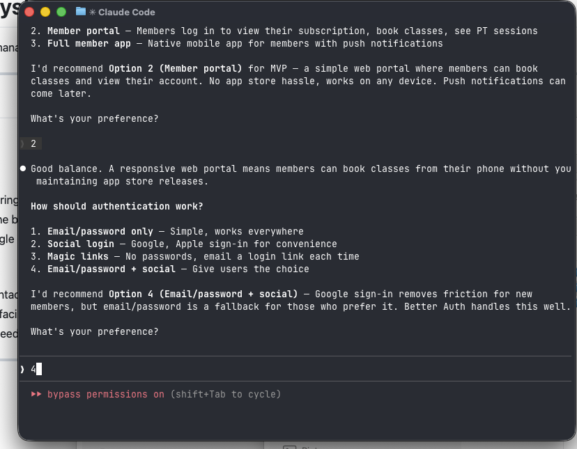

Options:
1. **Email/password only** — Simple, works everywhere
2. **Social login** — Google, Apple sign-in
3. **Magic links** — No passwords, email a link each time
4. **Email/password + social** — Give users the choice

I chose **Option 4** — Google sign-in removes friction for new members, but email/password is a fallback. Better Auth handles this well.

---

## Question 7: Admin Access

**Why this question matters:** Gym owners need to delegate. Receptionists should check people in but not see billing. Trainers need their own session data but not member financials. Getting permissions wrong means either security risks or operational bottlenecks.

Options:
1. **Single owner** — One admin account
2. **Owner + staff roles** — Owner has full access, staff have limited permissions
3. **Full role system** — Custom permissions per role

I chose **Option 3** — a proper role-based permission system with receptionist, trainer, manager, and owner roles. This sets us up for multi-gym expansion later.

---

## Question 8: Tech Stack

**Why this question matters:** The tech stack affects development speed, type safety, hosting options, and long-term maintainability. The wrong choice here ripples through every feature.

Options:
1. **Next.js + Drizzle + PostgreSQL** — Full-stack React, type-safe ORM
2. **Next.js + Prisma + PostgreSQL** — Similar but Prisma is more established
3. **Separate frontend/backend** — More flexibility, more complexity
4. **No preference** — Let the agent decide

I chose **Option 4** — no preference. The agent went with Next.js + Drizzle + PostgreSQL for type safety and their knowledge base coverage.

---

## Question 9: Deployment

**Why this question matters:** Deployment platform affects costs, scaling, DevOps overhead, and edge performance. Vercel is convenient but expensive at scale. Self-hosted gives control but requires maintenance.

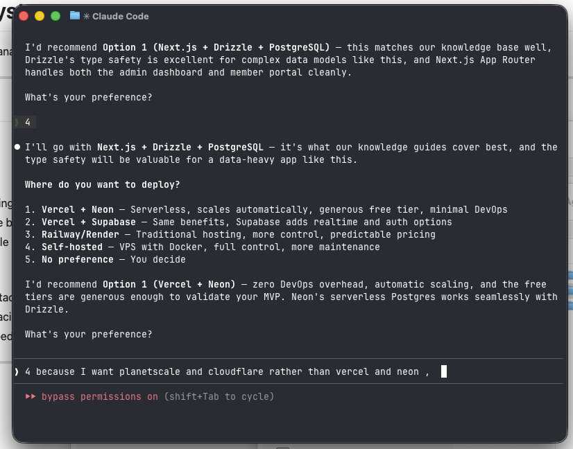

Here's where I pushed back. The agent recommended Vercel + Neon, but I wanted **PlanetScale + Cloudflare**.

This triggered a follow-up question about how to run Next.js on Cloudflare:

I chose **Option 2** — Cloudflare Workers + Hono backend, with React SPAs on Cloudflare Pages. Two deployments, but cleaner architecture and full control over the API.

---

## The Correction Moment

The agent presented an architecture diagram with PlanetScale showing MySQL:

I pointed out that PlanetScale now offers Postgres. The agent was skeptical (their knowledge had it as MySQL-only), so I provided the URL.

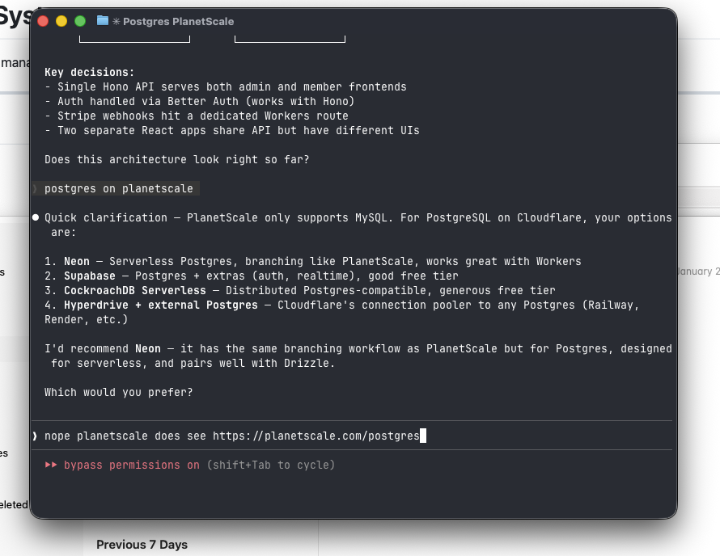

The agent fetched the page, confirmed PlanetScale now offers Postgres with their signature branching workflow, and updated the architecture:

**This is important:** The agent didn't just accept my correction blindly — it verified by fetching the actual documentation. When I was right, it updated its understanding and moved forward with accurate information.

---

## The Design Sections

With all decisions made, the agent presented the technical design in sections, asking for confirmation after each.

### Data Model

The complete entity relationship diagram: Gym, User, Member, CheckIn, ClassType, Class, ClassBooking, Trainer, PTPackage, PTSession, Plan. Each table's fields defined, relationships mapped.

### Permissions Matrix

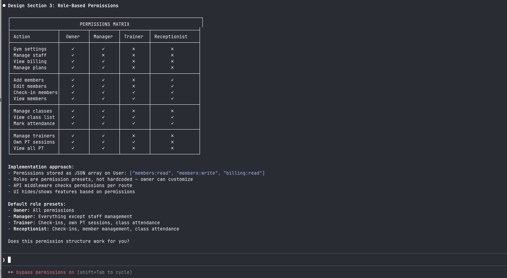

A clear grid showing which roles can do what. Owner gets everything. Manager gets most things except staff management. Trainer and Receptionist have focused permissions for their jobs.

### Stripe Integration

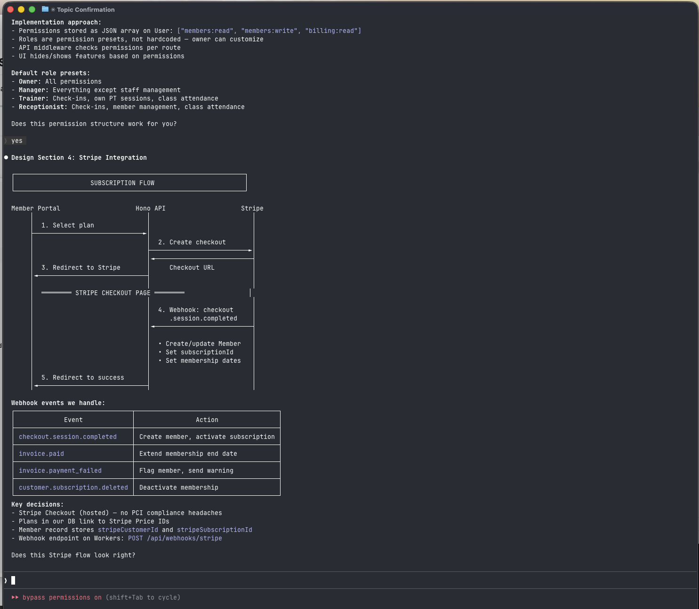

The subscription flow diagrammed: member selects plan → API creates checkout session → redirect to Stripe → webhook creates member on success. Plus the webhook events we need to handle.

### Member Portal Features

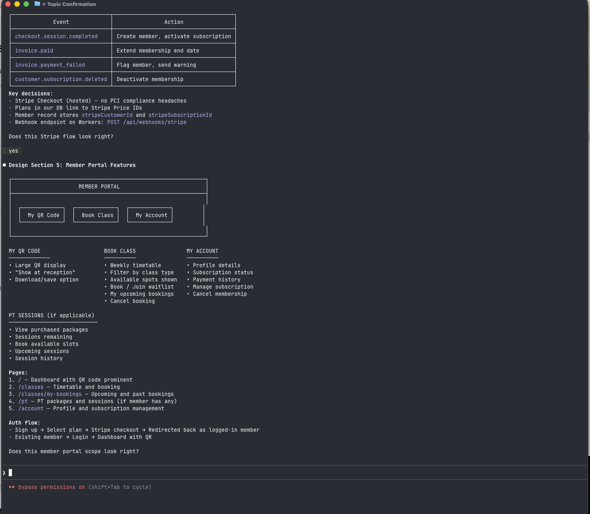

What members see: QR code display, class timetable and booking, PT packages, account management. Page structure defined.

### Admin Dashboard Features

What staff see: dashboard with stats, member management with QR scanner, class scheduling, trainer management, billing, settings. The QR scanner gets a dedicated full-screen route.

---

## The Output

After I approved the final section, the agent generated a complete project package:

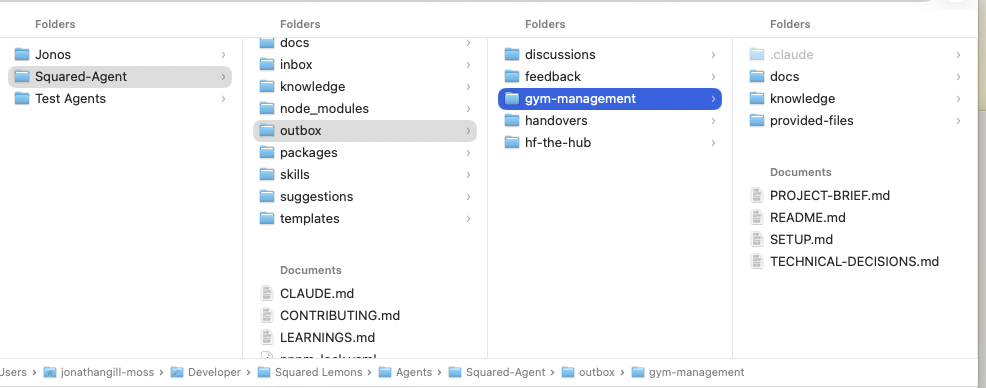

I copied the output project to a fresh folder on my machine:

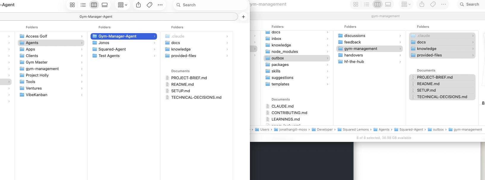

The `outbox/gym-management/` folder contains:
- **README.md** — Project overview and architecture
- **PROJECT-BRIEF.md** — Business context from the discovery
- **TECHNICAL-DECISIONS.md** — Every stack choice with rationale
- **SETUP.md** — Build instructions for the next agent
- **docs/plans/** — The full design document
- **knowledge/** — Relevant guides (Better Auth, Drizzle, patterns)
- **.claude/commands/** — Slash commands for the target project
- **provided-files/** — My original scope document

---

## Building the Project

The project package isn't just documentation — it's a complete handoff to another your code agent session. The entire build process — from initial project setup to a working application with two frontend apps, an API, and a SQLite database — took approximately 45 minutes.

The system includes:
- **Admin Dashboard**: Canvas-panel navigation for gym staff to manage members, classes, trainers, and check-ins
- **Member Portal**: Mobile-first interface for members to view their QR code, book classes, and manage their account
- **API**: Hono-based REST API running on Cloudflare Workers
- **Database**: SQLite with Drizzle ORM for local development

### Starting the Session

The build began with the `/start-session` command in your code agent, which automatically detected existing setup documentation in the project.

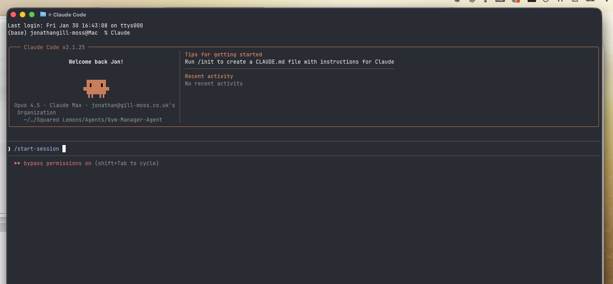

*your code agent v2.1.25 greeting with the familiar robot mascot*

### Setup Document Detection

your code agent found the SETUP.md file containing the project specification and offered several options for how to proceed.

*The setup wizard detected the Gym Management System specification and offered options: Run Setup, Skip, Archive, or Chat about it*

### Project Planning

After selecting "Run Setup", the agent analyzed the requirements and created a comprehensive implementation plan. The setup document outlined:

- 7 implementation phases (Foundation through Polish)
- Monorepo with pnpm/Turborepo
- Cloudflare Workers API + Two React SPAs
- Key entities: Members, Classes, Trainers, Plans

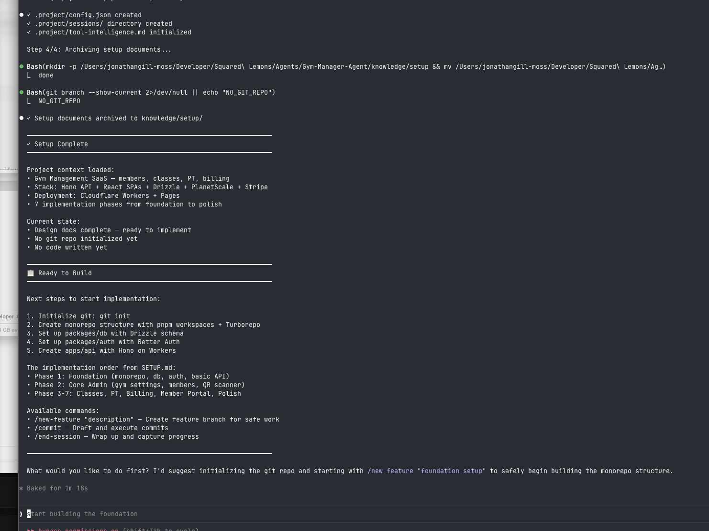

*The agent reading the setup document and presenting the implementation roadmap*

### Creating the Foundation

The agent began by creating the monorepo structure with all necessary configuration files:

- `package.json` with workspace configuration
- `turbo.json` for build orchestration
- `tsconfig.json` for TypeScript
- `pnpm-workspace.yaml` for package management

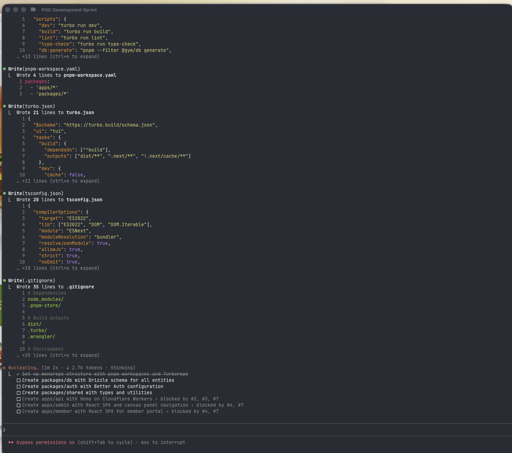

*Writing turbo.json, package.json, and workspace configuration*

### Parallel Subagents

The agent used parallel subagents to build multiple packages simultaneously. Three background agents were spawned to work on:

1. **packages/db**: Drizzle schema with 14 tables
2. **packages/auth**: Better Auth configuration with Hono middleware
3. **packages/shared**: 1,500+ lines of shared types and utilities

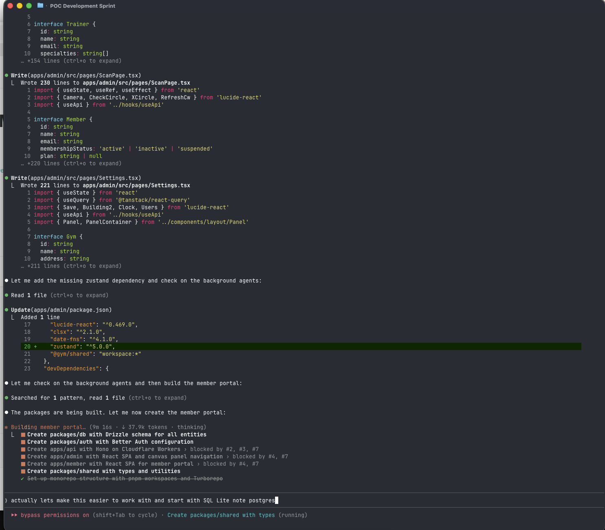

*Three subagents running in parallel while the main agent builds the API and frontends*

In the screenshot you can see I'm asking to switch from Postgres to SQLite. This was to get things running quickly on my local machine — migrating up to a larger-scale platform is much easier than migrating down, so starting with SQLite for a POC is fine.

### Fixing TypeScript Errors

After the initial build, the agent systematically fixed TypeScript errors across the codebase—unused imports, type mismatches, and configuration issues.

*Resolving type errors to achieve a clean build*

### POC Complete

The first major milestone was reached: all packages built successfully with clean type checking across 57 TypeScript files.

*Build summary showing all three agents completed successfully:*
- packages/db: 480 lines, Drizzle schema, 12 tables
- packages/auth: 250 lines, Better Auth + Hono middleware
- packages/shared: 4,800 lines of shared types and utilities
- Total: 57 files, 4,000 lines of TypeScript

### SQLite Migration

After the initial build with PostgreSQL/Neon, I requested a switch to SQLite for easier local development. The agent performed a complete database migration:

- Updated Drizzle config to SQLite dialect
- Converted all schema files from `pgTable` to `sqliteTable`
- Changed `pgEnum` to TypeScript union types
- Updated timestamp and boolean column types

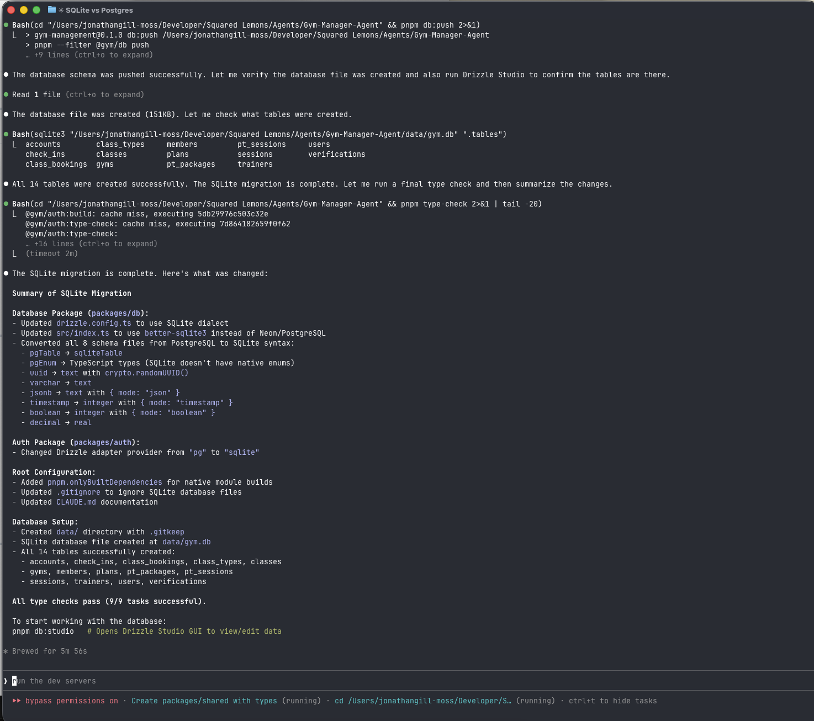

*Summary of the SQLite migration with all 14 tables created*

### Running the Application

With the build complete, running `pnpm dev` starts all three services via Turborepo:

*Terminal showing the pnpm dev command*

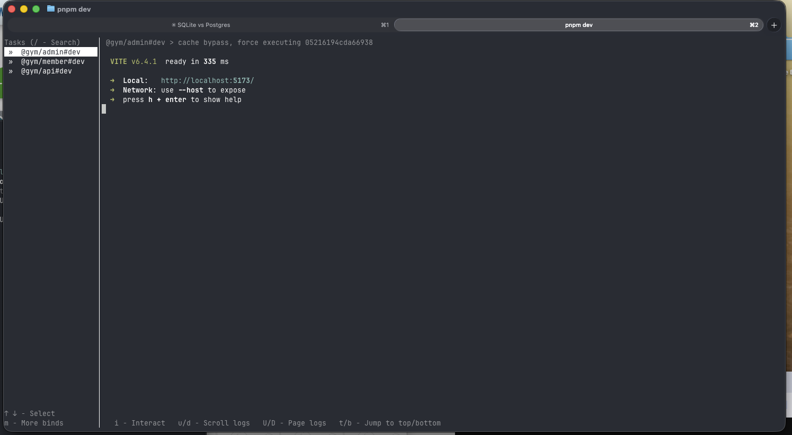

*Vite v6.4.1 ready in 335ms with all three dev tasks running*

### The Admin Dashboard

The admin dashboard features a clean, professional login interface.

*"Welcome Back - Sign in to manage your gym" with email/password authentication*

The main dashboard provides at-a-glance metrics and activity feeds.

*Dashboard showing:*
- 67 Check-ins Today (+12% from yesterday)
- 198 Active Members (+5 this week)
- 12 Classes Today
- £15,420 Monthly Revenue (+3.5% from last month)
- Recent check-ins feed
- Today's class schedule

The members section uses a canvas-panel navigation pattern—selecting a member opens their details in an adjacent panel.

*Members list with status badges (active/inactive) and search functionality*

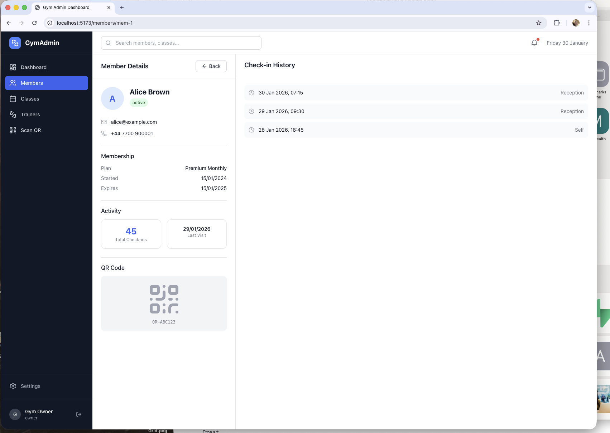

*Member detail panel showing:*
- Contact information
- Membership plan and dates
- Activity statistics (45 total check-ins)
- Check-in history
- QR code for scanning

The classes section displays both the daily schedule and available class types.

*Today's Schedule panel alongside Class Types:*
- Morning: Yoga Flow (15/20 booked)
- Afternoon: HIIT Training (25/25 full, 3 waitlisted)
- Evening: Spin Class (22/30 booked)

*Class detail view with:*
- Booking list
- Capacity visualization (75% full)
- Mark Attendance and Send Reminder actions
- Edit/Cancel options

The trainers section shows staff profiles with their specialties and active PT packages.

*Trainer cards showing:*
- Sarah Johnson: Yoga, Pilates, Stretching - £45/hr
- Mike Williams: HIIT, Strength Training, Boxing - £50/hr
- Active PT package: Alice Brown with Sarah (3/10 sessions used)

The Scan QR page enables quick member check-ins via camera or manual code entry.

*Check-in interface with camera view and manual entry option*

### The Member Portal

The member portal is designed mobile-first with a native app feel.

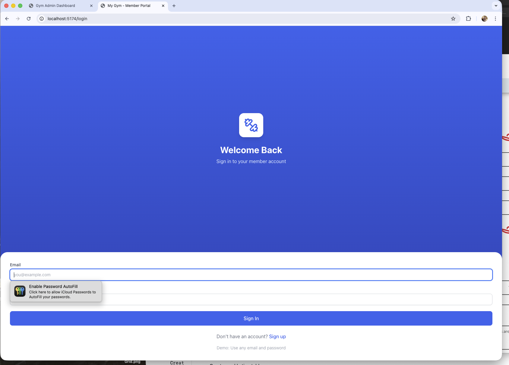

*Blue-themed login screen for members*

After login, members see their QR code prominently displayed for easy check-in at reception.

*Member home screen featuring:*
- Personal QR code (QR-ABC123)
- Membership status (Premium Monthly - Active)
- Upcoming classes
- Quick actions: Book a Class, Check-in History
- Bottom navigation: Home, Classes, Bookings, Account

Members can browse and book classes with a weekly calendar view.

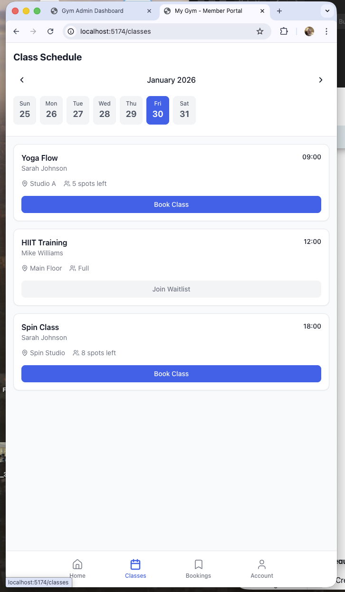

*Class Schedule for January 2026:*
- Yoga Flow (5 spots left) - Book Class
- HIIT Training (Full) - Join Waitlist
- Spin Class (8 spots left) - Book Class

The bookings section shows upcoming and past reservations with easy cancellation.

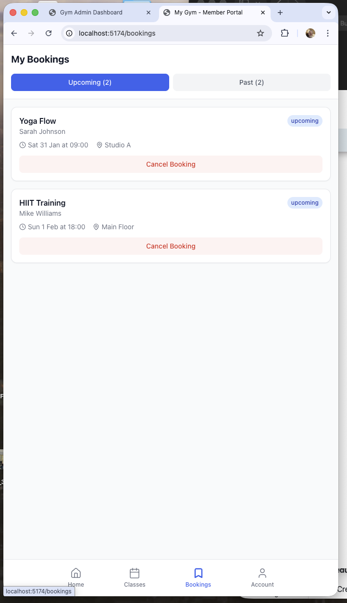

*Upcoming (2) and Past (2) tabs with booking cards*

The account page displays membership details and check-in history.

*Account screen showing:*
- Profile information
- Membership status (Active)
- Manage Subscription link
- Recent check-ins timeline
- Sign Out button

### Technical Stack

| Component | Technology |
|-----------|------------|
| Monorepo | pnpm workspaces + Turborepo |
| API | Hono on Cloudflare Workers |
| Frontend | React 19 + Vite + TanStack Query |
| Styling | Tailwind CSS |
| Database | SQLite + Drizzle ORM |
| Auth | Better Auth (email/password) |
| Payments | Stripe (placeholder) |

### Project Statistics

- **Total build time**: ~45 minutes
- **TypeScript files**: 57
- **Lines of code**: ~8,000+
- **Database tables**: 14
- **API endpoints**: 7 route groups
- **React components**: 40+

### What's Next

The V1 POC provides a solid foundation. Next steps include:

1. Connect API routes to the real SQLite database
2. Implement Better Auth session management
3. Add Stripe checkout flow for subscriptions
4. Deploy to Cloudflare Workers/Pages
5. Add PostgreSQL support for production

You now have a base project all wired up and ready to build, following your master agent's best practices.

---

## Tracking Usage Across Sessions

Every project that inherits the session workflow gets automatic usage tracking. The `/start-session` and `/end-session` commands bookend your work, and `/end-session` extracts token data from your code agent's session files.

This data accumulates in `.project/token-usage.md` and `.project/sessions/` — local to each repo, gitignored so it stays personal.

The master agent includes a dashboard app to visualize this data:

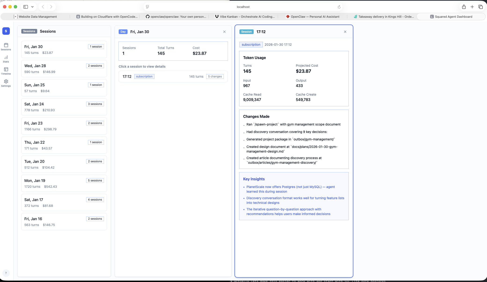

The dashboard shows:
- **Sessions list** — Every session by date, with turn count and cost
- **Token breakdown** — Input, output, cache reads, cache creation
- **Changes made** — What was accomplished in each session (pulled from session notes)
- **Key insights** — Patterns the agent learned (like "PlanetScale now offers Postgres")

**Why this matters:**
- **Cost visibility** — See exactly what each feature cost to build
- **Pattern discovery** — Which sessions were expensive? What made them expensive?
- **Subscription tracking** — Are you hitting your daily limits? Is your tier appropriate?
- **API vs subscription** — Background agents use API billing; track them separately

The gym-management build session shown above: **145 turns, $23.87** in API costs (background agents building in parallel). That's the cost of going from feature list to working monorepo.

---

## Why This Process Works

### 1. One Question at a Time
Each question focused on a single decision. No overwhelming walls of options. This made it easy to think through each choice without context-switching.

### 2. Recommendations with Rationale
The agent didn't just list options — it recommended one and explained why. This gave me a baseline to agree with or push back against.

### 3. Trade-offs Acknowledged
When I chose Stripe subscriptions over record-keeping, the agent noted this adds complexity. When I chose a full role system, it acknowledged this is more work but sets up for future scale. No decision was presented as cost-free.

### 4. Corrections Welcome
When I corrected the agent about PlanetScale Postgres, it verified the claim and updated its understanding. The conversation stayed collaborative, not adversarial.

### 5. Design in Sections
The architecture wasn't dumped all at once. Each section was presented, explained, and confirmed before moving on. This caught misunderstandings early.

### 6. Complete Handoff
The output isn't just a document — it's a ready-to-use project package with all the context a build agent needs.

---

## Time Spent

The entire conversation took about 15 minutes. At the end, I had:
- A validated technical architecture
- A complete data model
- Clear permission boundaries
- Defined user flows
- A project package ready for implementation

Compare this to the traditional approach: write a PRD, have meetings to discuss architecture, create separate technical design docs, align on data models... The discovery conversation compresses all of that into a focused dialogue.

---

## Try It Yourself

The `/spawn-project` command is part of the [Squared Agent](https://github.com/squared-lemons/squared-agent) system. Pass it a feature list, a rough idea, or even just a problem statement — and let the discovery conversation shape it into a buildable design.

Spawned projects inherit the session workflow automatically:
- `/start-session` — Detects setup docs, loads context, checks for handovers
- `/end-session` — Captures learnings, extracts token usage, offers to commit

Run `pnpm dev` in the master agent to launch the dashboard and see your usage across all projects.
