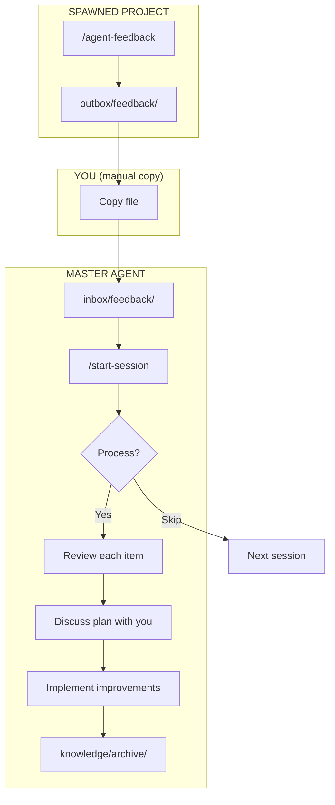

# Agent Feedback System

How learnings from spawned projects flow back to improve your master agent.

---

## How It Works

**Everything is local files.** There's no network, no telemetry, no data leaving your machine. You control when and what feedback moves between projects by copying files yourself.



---

## The Process in Detail

### 1. Generate Feedback (Spawned Project)

Run `/agent-feedback` when you've learned something worth sharing:

```
/agent-feedback
```

The command analyzes your session for:

| Category | What It Captures |
|----------|------------------|
| **Knowledge Gaps** | Missing info in guides, outdated patterns, new patterns worth documenting |
| **Setup Issues** | Missing configuration, gotchas during development, things to pre-configure |
| **New Patterns** | Reusable code patterns, workflows worth standardizing, shared components |
| **Technical Gotchas** | Library issues, config settings, error messages with non-obvious solutions |

**Output:** `outbox/feedback/feedback-YYYY-MM-DD.md`

### 2. Transfer Feedback (You)

Copy the file to your master agent's inbox:

```bash
cp spawned-project/outbox/feedback/*.md master-agent/inbox/feedback/
```

This is the only way feedback moves. You decide what goes back.

### 3. Detect Feedback (Master Agent)

Next time you run `/start-session` in the master agent:

```
━━━━━━━━━━━━━━━━━━━━━━━━━━━━━━━━━━━━━━━━━━━━━━━━━━━━━━━━━━━━━━━━
📬 Pending Items
━━━━━━━━━━━━━━━━━━━━━━━━━━━━━━━━━━━━━━━━━━━━━━━━━━━━━━━━━━━━━━━━

Feedback to process (inbox/feedback/):
  • feedback-2026-01-24.md (Gym Management Project)

━━━━━━━━━━━━━━━━━━━━━━━━━━━━━━━━━━━━━━━━━━━━━━━━━━━━━━━━━━━━━━━━
```

Options:
- **Process now** — Review and implement inline
- **Skip** — Continue working, will remind next session
- **Don't show again** — Disable feedback detection

### 4. Plan Implementation (Master Agent)

When you choose to process, the agent:

1. **Reads the feedback** — Loads the full file and summarizes each item
2. **Proposes a plan** — For each item, suggests how to implement:
   - Update knowledge guide? Which file, what to add?
   - Add to CLAUDE.md? What pattern or gotcha?
   - Create new command? What should it do?
   - Note for later? Add to `suggestions/` folder
3. **Discusses with you** — You can adjust, skip items, or change approach
4. **Gets your approval** — Nothing happens until you agree

Example discussion:

```
━━━━━━━━━━━━━━━━━━━━━━━━━━━━━━━━━━━━━━━━━━━━━━━━━━━━━━━━━━━━━━━━
Processing Feedback: feedback-2026-01-24.md
━━━━━━━━━━━━━━━━━━━━━━━━━━━━━━━━━━━━━━━━━━━━━━━━━━━━━━━━━━━━━━━━

## Item 1: Better Auth requires serverExternalPackages

Suggested action: Add to templates/knowledge/auth/better-auth/Better-Auth-Guide.md

Add to "Common Gotchas" section:
  "Add better-auth to serverExternalPackages in next.config.js"

Implement this? [Yes / Skip / Different approach]
```

### 5. Implement Changes (Master Agent)

For approved items, the agent makes the changes:

- Edits knowledge files
- Updates CLAUDE.md
- Creates suggestions for future work
- Runs any verification steps

### 6. Archive Feedback (Master Agent)

After processing all items:

```bash
mv inbox/feedback/feedback-2026-01-24.md knowledge/archive/
```

The feedback file moves to `knowledge/archive/` — your accumulated learnings become part of your knowledge base.

---

## Why Files?

| Approach | What Happens |
|----------|--------------|
| **Network/API** | Data leaves your machine, you don't control it |
| **Auto-sync** | Magic that might do things you don't want |
| **Manual files** | You copy what you want, when you want, to where you want |

The file-based approach means:
- **Full transparency** — Open the file, see exactly what's being shared
- **Full control** — Edit before sending, or don't send at all
- **No dependencies** — Works offline, no accounts, no services
- **Audit trail** — Archive shows everything ever processed

---

## Feedback Format

```markdown
## Feedback from [Project Name] - YYYY-MM-DD

### Knowledge Gaps
- Better Auth requires `serverExternalPackages` in next.config.js but this wasn't documented
- Drizzle migrations need `--config` flag when not in project root

### Setup Issues
- Should pre-configure `.env.example` with all required vars
- PostToolUse hook for formatting should be in developer profile

### New Patterns
- Session helper pattern: `getSessionWithOrg()` for multi-tenant apps
- QR code as data URL to avoid file storage

### Technical Gotchas
- useSearchParams needs Suspense boundary in Next.js App Router
- window.location.href required after auth changes (router.push doesn't work)
```

---

## Best Practices

### Be Specific
Instead of "auth was confusing", say "Better Auth requires `serverExternalPackages` in next.config.js but this wasn't documented".

### Include Solutions
If you figured something out, include the solution so others don't have to.

### Note Library Versions
If a gotcha is version-specific, note which version you were using.

### Skip Routine Sessions
Only send feedback if you discovered something worth sharing. Routine sessions without issues don't need feedback.

---

## Related Commands

| Command | Where | Purpose |
|---------|-------|---------|
| `/agent-feedback` | Spawned project | Generate feedback file to `outbox/feedback/` |
| `/start-session` | Master agent | Detect and offer to process feedback |
| `/get-feedback` | Master agent | Process feedback on demand (alternative to `/start-session`) |

---

## Folder Reference

```
master-agent/
├── inbox/
│   └── feedback/           # Pending feedback from projects
│       └── *.md
├── knowledge/
│   └── archive/            # Processed feedback (historical record)
│       └── *.md
└── suggestions/            # Items noted for later implementation
    ├── knowledge/
    ├── commands/
    └── workflow/

spawned-project/
└── outbox/
    └── feedback/           # Generated feedback ready to send
        └── feedback-*.md
```
