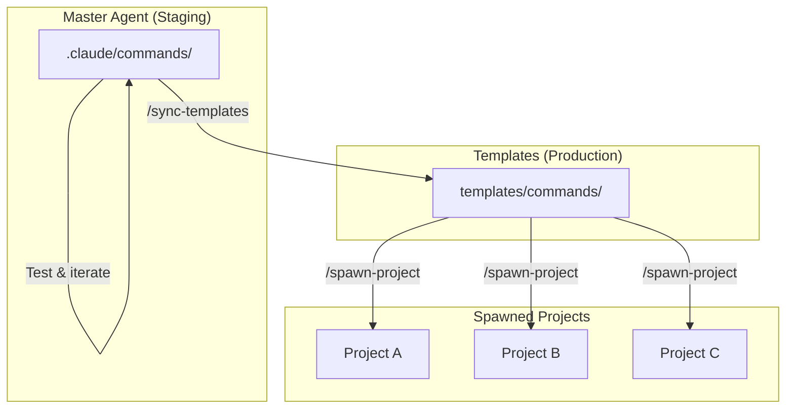

# Template Sync Workflow

How the master agent evolves commands safely before propagating them to spawned projects.

---

## The Problem

When you improve a command in `.claude/commands/`, those improvements only exist in the master agent. Spawned projects still get the old version from `templates/commands/`. Without a sync mechanism, your best practices diverge from what new projects receive.

---

## The Solution: Evolve Then Deploy

The master agent acts as a **staging environment** for command improvements. You test changes locally, then propagate them when ready.



**Key insight:** Changes in `.claude/commands/` don't affect templates until you explicitly sync. This gives you a safe space to experiment.

---

## Workflow

### 1. Improve Commands Locally

Edit commands in `.claude/commands/` as you use them. When something works better, update the command.

```
.claude/commands/
├── start-session.md      ← Your active commands
├── end-session.md
├── new-feature.md
└── ...
```

### 2. Test Your Changes

Use the commands in your daily workflow. The master agent runs the `.claude/commands/` versions, so you're always testing the latest.

### 3. Check for Drift

See what's changed since the last sync:

```
/sync-templates --audit
```

This shows:
- Commands that have drifted from templates
- Differences between active and template versions
- Commands that exist in one location but not the other

### 4. Sync When Ready

When your improvements are tested and working well:

```
/sync-templates
```

This updates `templates/commands/` to match `.claude/commands/`:
- Code blocks are replaced with the active version
- Prose and documentation are preserved
- Future spawned projects get your improvements

### 5. Future Projects Inherit

The next time you run `/spawn-project`, the new project receives your improved commands automatically.

---

## Integration Points

The sync workflow integrates with your session lifecycle:

| When | What Happens |
|------|--------------|
| `/start-session` | Background audit checks for drift (silent) |
| `/end-session` | Prompts to sync if drift detected |
| `/complete-feature` | Prompts to sync if drift detected |

If templates have drifted, you'll see a prompt asking if you want to sync before completing your session or feature.

---

## Command Reference

### `/sync-templates`

Full sync - updates templates to match active commands.

### `/sync-templates --audit`

Report only - shows drift without making changes.

### `/sync-templates --background`

Silent audit - writes report to `.project/sync-report.md` for later review. Used by `/start-session`.

---

## Example Session

```
# Start your day
/start-session
→ Background audit runs silently

# Work on improvements
# You notice /commit could be better, so you edit .claude/commands/commit.md

# Test your changes
/commit
→ Uses your improved version

# More testing throughout the day...

# End session - drift detected
/end-session
→ "Templates have drifted. Sync now?"
→ Yes - templates updated

# Next project gets your improvement
/spawn-project "my next project"
→ Receives the improved /commit command
```

---

## Why This Matters

- **Safe experimentation** - Try ideas without affecting spawned projects
- **Intentional propagation** - Changes only spread when you're confident
- **Version control** - Templates in git show the history of your best practices
- **Feedback loop** - Spawned projects can suggest improvements back

The master agent becomes the place where patterns are refined before deployment, ensuring every new project starts with your tested, proven workflows.
