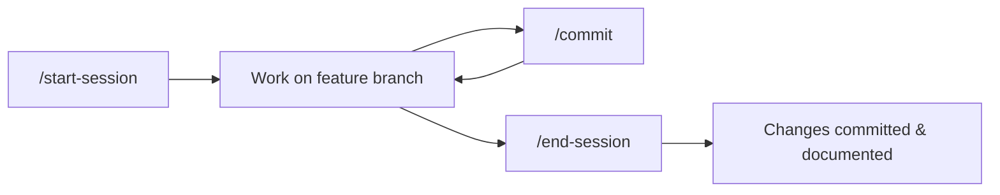
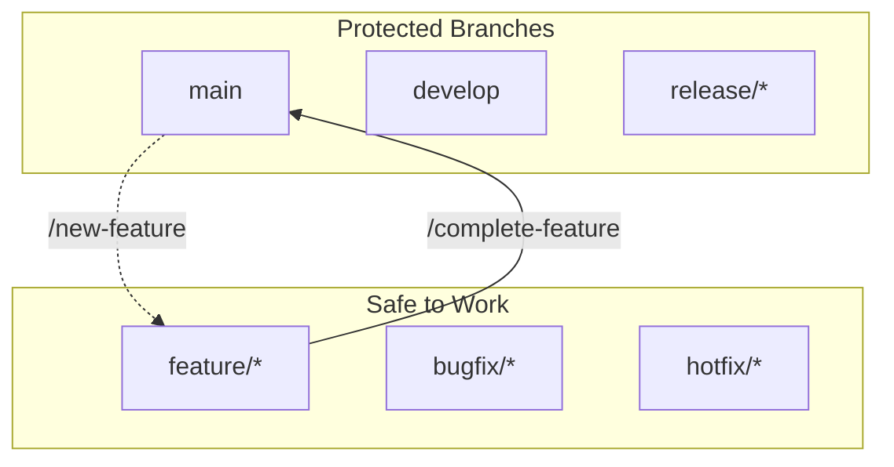
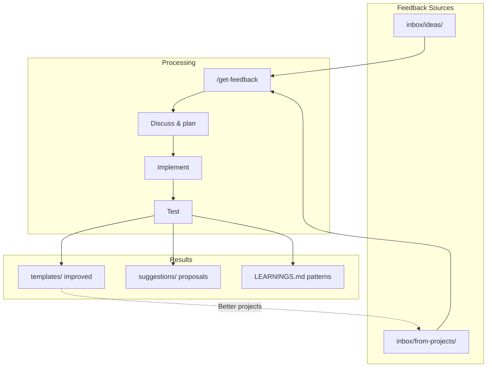

# Development Workflow

How this agent encourages safe, organized development.

---

## Core Principles

1. **Never work on protected branches** - Always use feature branches
2. **Start and end sessions intentionally** - Load context, capture learnings
3. **Feedback improves the agent** - Every project teaches something
4. **Plan before implementing** - Discuss complex changes first

---

## The Session Lifecycle



### Starting a Session

```
/start-session
```

This command:
- Checks if you're on a protected branch (warns if so)
- Shows git status (modified files, ahead/behind remote)
- Loads tool intelligence (learned shortcuts from past sessions)
- Shows session note or getting started guide

### During a Session

Work normally. Use `/commit` for quick commits when you reach good stopping points.

### Ending a Session

```
/end-session
```

This command:
- Updates documentation (README, CLAUDE.md)
- Captures learnings in LEARNINGS.md
- Saves session log
- Commits with your approval

---

## Branch Workflow



### Starting New Work

If you're on `main` or another protected branch:

```
/new-feature "add user authentication"
```

This creates a feature branch like `feature/add-user-authentication` and switches to it.

### Completing Work

When your feature is ready:

```
/complete-feature
```

This offers two options:
- **Merge to main** (solo workflow)
- **Create pull request** (team workflow)

---

## The Feedback Loop



### Adding Feedback

**Your ideas:**
Drop markdown files in `inbox/ideas/` with your thoughts, suggestions, or feature requests.

**Project feedback:**
When you run `/end-session` in a spawned project, it generates feedback. Save that to `inbox/from-projects/`.

### Processing Feedback

```
/get-feedback
```

This command:
1. Scans both inbox folders
2. Presents summaries of each feedback item
3. Helps you select what to work on
4. Guides planning and implementation
5. Archives processed feedback

---

## Command Quick Reference

| Phase | Command | Purpose |
|-------|---------|---------|
| **Start** | `/start-session` | Load context, check branch |
| **Create** | `/new-feature` | Start safe feature branch |
| **Work** | `/commit` | Quick commit during work |
| **Finish** | `/complete-feature` | Merge or create PR |
| **End** | `/end-session` | Document and commit |
| **Improve** | `/get-feedback` | Process inbox, implement |
| **Review** | `/summary` | See what you accomplished |

---

## Example: Adding a New Feature

```
# 1. Start your session
/start-session

# 2. You're on main - create feature branch
/new-feature "add dark mode support"

# 3. Work on the feature...
#    (make changes, test, iterate)

# 4. Commit progress
/commit

# 5. More work...

# 6. Feature complete - merge it
/complete-feature

# 7. End session with documentation
/end-session
```

---

## Example: Processing Feedback

```
# 1. Start session
/start-session

# 2. Check what feedback we have
/get-feedback

# 3. Select and discuss an idea
#    (conversation about the feedback)

# 4. Create branch for implementation
/new-feature "implement requested feature"

# 5. Plan and implement
#    (with agent assistance)

# 6. Test the changes

# 7. Complete and document
/complete-feature
/end-session
```

---

## Tips

- **Commit often** - Small commits are easier to review and revert
- **Descriptive branch names** - Help future-you understand what each branch was for
- **Capture learnings** - The `/end-session` command does this automatically
- **Use plan mode** - For complex changes, press `Shift+Tab` twice to plan first
- **Read CLAUDE.md** - It has the rules this agent follows
