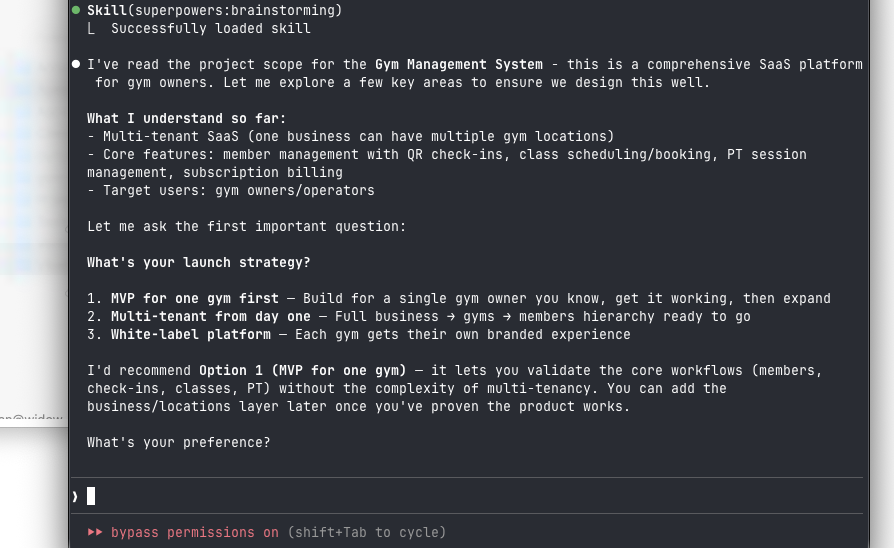
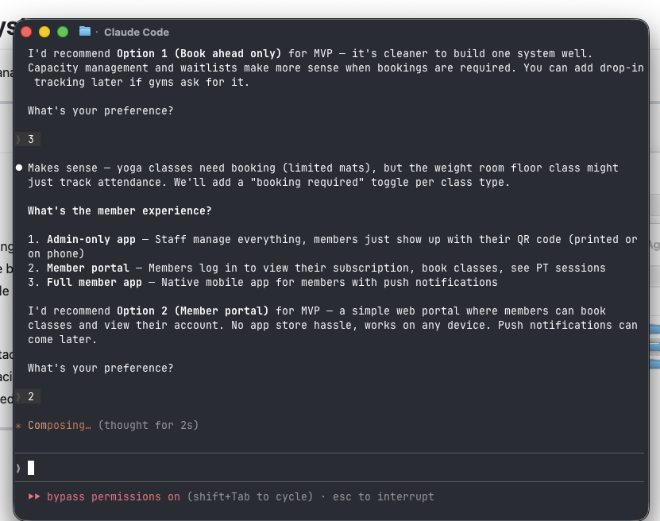
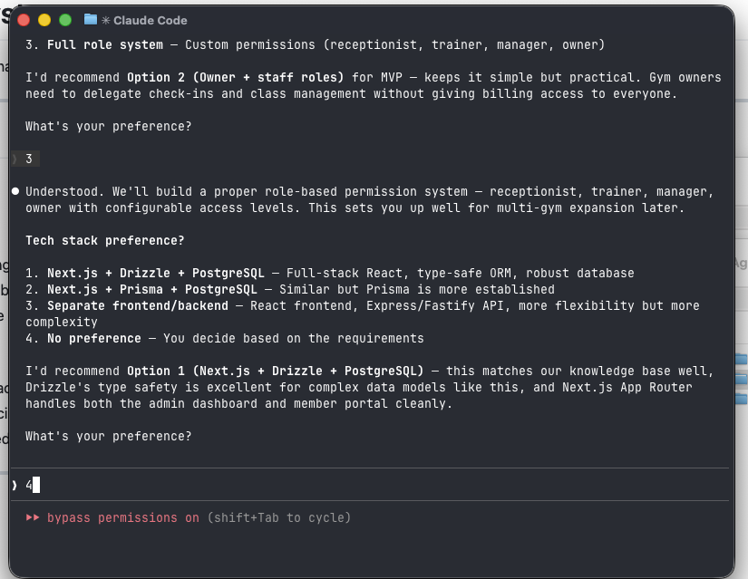
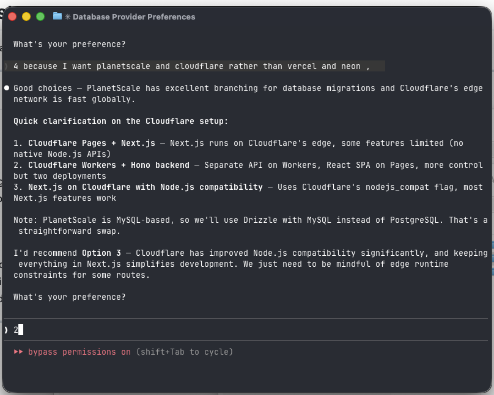
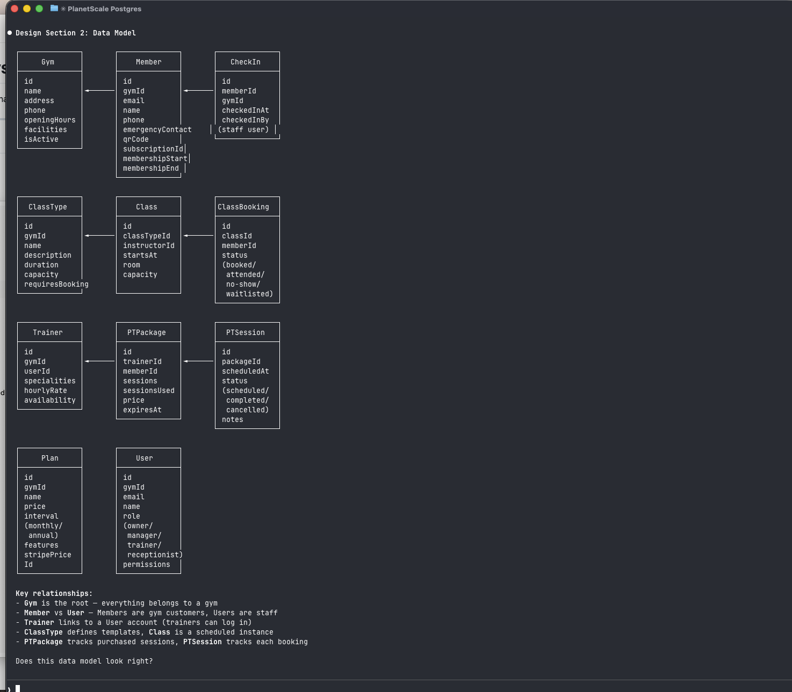
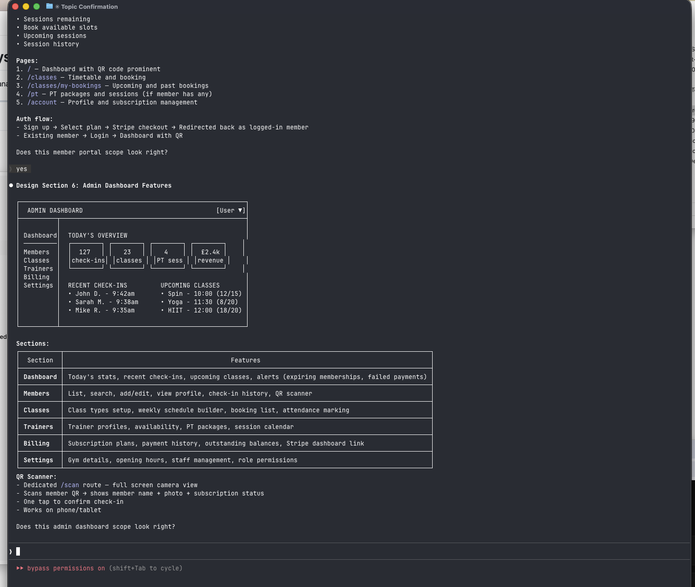
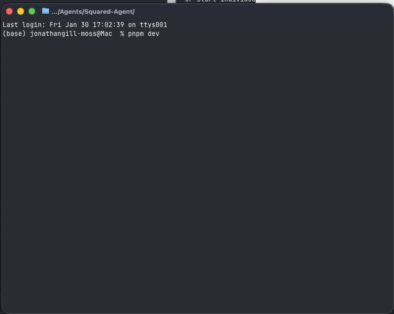

# From Idea to Architecture: A Discovery Conversation with Claude Code

How a 15-minute conversation turned a feature list into a complete technical design.

---

## The Starting Point

I had a markdown file on my desktop — a feature list for a gym management system. Member tracking, QR check-ins, class bookings, personal training, payments. The usual SaaS feature dump.

The document described *what* the system should do, but not *how* to build it. That's where the discovery conversation comes in.

---

## Starting the Conversation

I used Claude Code's `/spawn-project` command, passing my scope document as context:

The agent read my document, summarised what it understood, and immediately asked the first strategic question.

---

## Question 1: Launch Strategy

**Why this question matters:** The scope document mentioned "multiple gym locations under one business" — multi-tenant architecture. But multi-tenancy adds significant complexity to every part of the system: data isolation, authentication, billing, permissions.

The agent presented three options:
1. **MVP for one gym first** — Validate core workflows, add multi-tenancy later
2. **Multi-tenant from day one** — Full business → gyms → members hierarchy ready to go
3. **White-label platform** — Each gym gets their own branded experience

I chose **Option 1** — starting with a single gym keeps the data model simple while we nail the core experience. The agent acknowledged this trades immediate scale for faster validation.

---

## Question 2: Payment Handling

**Why this question matters:** Payments are one of the highest-complexity features in any SaaS. Stripe webhooks, failed payment handling, refunds, tax calculations — each adds development time and edge cases.

Options presented:
1. **Stripe subscriptions** — Members pay directly through the app
2. **Record-keeping only** — Gym handles payments externally, app just tracks
3. **Hybrid** — Support both online payments and manual recording

The agent recommended Option 2 for MVP — most gym owners already have payment systems. But I chose **Option 1** because I wanted a complete product where members can sign up and pay directly. The agent noted this means handling webhooks and subscription lifecycle carefully.

---

## Question 3: QR Code Check-ins

**Why this question matters:** The check-in experience affects hardware requirements, development complexity, and daily operations. Getting this wrong means friction at the gym entrance every single day.

Options:
1. **Staff-scanned** — Reception staff scans member's QR code
2. **Self-service kiosk** — Tablet at entrance
3. **Turnstile/access control** — Integrate with physical hardware
4. **App-based** — Geofence or manual "I'm here" button

I chose **Option 1** — simplest to build, works everywhere, no hardware dependencies. Staff just need a phone or tablet with the admin app open.

---

## Question 4: Class Bookings

**Why this question matters:** Gyms run different types of classes. A yoga class with 15 mats needs booking. A weights floor "class" might just need attendance tracking. Building the wrong model means either over-engineering or missing real needs.

Options:
1. **Book ahead only** — Members reserve spots, capacity enforced
2. **Drop-in tracking** — No booking, just record attendance after
3. **Both** — Some classes require booking, others are drop-in

I chose **Option 3** — yoga classes need booking (limited mats), but the weight room floor class might just track attendance. The agent noted we'll add a "booking required" toggle per class type.

---

## Question 5: Member Experience

**Why this question matters:** This determines the entire frontend architecture. A native mobile app means app store releases, two codebases, push notification infrastructure. A web portal is simpler but less engaging.

Options:
1. **Admin-only app** — Staff manage everything, members just show up
2. **Member portal** — Web portal for booking classes and viewing accounts
3. **Full member app** — Native mobile app with push notifications

I chose **Option 2** — a responsive web portal works on any device without app store releases. The agent agreed this is the right balance for MVP.

---

## Question 6: Authentication

**Why this question matters:** Authentication affects user experience, security, and integration complexity. Social login reduces friction but adds OAuth configuration. Magic links are simple but don't work offline.

Options:
1. **Email/password only** — Simple, works everywhere
2. **Social login** — Google, Apple sign-in
3. **Magic links** — No passwords, email a link each time
4. **Email/password + social** — Give users the choice

I chose **Option 4** — Google sign-in removes friction for new members, but email/password is a fallback. Better Auth handles this well.

---

## Question 7: Admin Access

**Why this question matters:** Gym owners need to delegate. Receptionists should check people in but not see billing. Trainers need their own session data but not member financials. Getting permissions wrong means either security risks or operational bottlenecks.

Options:
1. **Single owner** — One admin account
2. **Owner + staff roles** — Owner has full access, staff have limited permissions
3. **Full role system** — Custom permissions per role

I chose **Option 3** — a proper role-based permission system with receptionist, trainer, manager, and owner roles. This sets us up for multi-gym expansion later.

---

## Question 8: Tech Stack

**Why this question matters:** The tech stack affects development speed, type safety, hosting options, and long-term maintainability. The wrong choice here ripples through every feature.

Options:
1. **Next.js + Drizzle + PostgreSQL** — Full-stack React, type-safe ORM
2. **Next.js + Prisma + PostgreSQL** — Similar but Prisma is more established
3. **Separate frontend/backend** — More flexibility, more complexity
4. **No preference** — Let the agent decide

I chose **Option 4** — no preference. The agent went with Next.js + Drizzle + PostgreSQL for type safety and their knowledge base coverage.

---

## Question 9: Deployment

**Why this question matters:** Deployment platform affects costs, scaling, DevOps overhead, and edge performance. Vercel is convenient but expensive at scale. Self-hosted gives control but requires maintenance.

Here's where I pushed back. The agent recommended Vercel + Neon, but I wanted **PlanetScale + Cloudflare**.

This triggered a follow-up question about how to run Next.js on Cloudflare:

I chose **Option 2** — Cloudflare Workers + Hono backend, with React SPAs on Cloudflare Pages. Two deployments, but cleaner architecture and full control over the API.

---

## The Correction Moment

The agent presented an architecture diagram with PlanetScale showing MySQL:

I pointed out that PlanetScale now offers Postgres. The agent was skeptical (their knowledge had it as MySQL-only), so I provided the URL.

The agent fetched the page, confirmed PlanetScale now offers Postgres with their signature branching workflow, and updated the architecture:

**This is important:** The agent didn't just accept my correction blindly — it verified by fetching the actual documentation. When I was right, it updated its understanding and moved forward with accurate information.

---

## The Design Sections

With all decisions made, the agent presented the technical design in sections, asking for confirmation after each.

### Data Model

The complete entity relationship diagram: Gym, User, Member, CheckIn, ClassType, Class, ClassBooking, Trainer, PTPackage, PTSession, Plan. Each table's fields defined, relationships mapped.

### Permissions Matrix

A clear grid showing which roles can do what. Owner gets everything. Manager gets most things except staff management. Trainer and Receptionist have focused permissions for their jobs.

### Stripe Integration

The subscription flow diagrammed: member selects plan → API creates checkout session → redirect to Stripe → webhook creates member on success. Plus the webhook events we need to handle.

### Member Portal Features

What members see: QR code display, class timetable and booking, PT packages, account management. Page structure defined.

### Admin Dashboard Features

What staff see: dashboard with stats, member management with QR scanner, class scheduling, trainer management, billing, settings. The QR scanner gets a dedicated full-screen route.

---

## The Output

After I approved the final section, the agent generated a complete project package:

The `outbox/gym-management/` folder contains:
- **README.md** — Project overview and architecture
- **PROJECT-BRIEF.md** — Business context from the discovery
- **TECHNICAL-DECISIONS.md** — Every stack choice with rationale
- **SETUP.md** — Build instructions for the next agent
- **docs/plans/** — The full design document
- **knowledge/** — Relevant guides (Better Auth, Drizzle, patterns)
- **.claude/commands/** — Slash commands for the target project
- **provided-files/** — My original scope document

---

## Building the Project

The project package isn't just documentation — it's a complete handoff to another Claude Code session. When I opened the spawned project and ran `/start-session`, the agent detected the SETUP.md and offered to run the guided build:

The agent found the setup documents and presented options: run the setup, skip it, or archive it if I'd already built manually:

Once I chose "Run Setup", the agent loaded the project context — all the technical decisions, the data model, the architecture — and presented the implementation phases:

The build ran through foundation, then polish. Background agents handled parallel work: one creating the Drizzle schema, another setting up Better Auth, another building the Hono API. The final summary showed everything that was built:

**57 files, 4,800 lines of TypeScript** — a complete monorepo with member portal, admin dashboard, and API, all type-safe and ready to run.

---

## Tracking Usage Across Sessions

Every project that inherits the session workflow gets automatic usage tracking. The `/start-session` and `/end-session` commands bookend your work, and `/end-session` extracts token data from Claude Code's session files.

This data accumulates in `.project/token-usage.md` and `.project/sessions/` — local to each repo, gitignored so it stays personal.

The master agent includes a dashboard app to visualize this data:

The dashboard shows:
- **Sessions list** — Every session by date, with turn count and cost
- **Token breakdown** — Input, output, cache reads, cache creation
- **Changes made** — What was accomplished in each session (pulled from session notes)
- **Key insights** — Patterns the agent learned (like "PlanetScale now offers Postgres")

**Why this matters:**
- **Cost visibility** — See exactly what each feature cost to build
- **Pattern discovery** — Which sessions were expensive? What made them expensive?
- **Subscription tracking** — Are you hitting your daily limits? Is your tier appropriate?
- **API vs subscription** — Background agents use API billing; track them separately

The gym-management build session shown above: **145 turns, $23.87** in API costs (background agents building in parallel). That's the cost of going from feature list to working monorepo.

---

## Why This Process Works

### 1. One Question at a Time
Each question focused on a single decision. No overwhelming walls of options. This made it easy to think through each choice without context-switching.

### 2. Recommendations with Rationale
The agent didn't just list options — it recommended one and explained why. This gave me a baseline to agree with or push back against.

### 3. Trade-offs Acknowledged
When I chose Stripe subscriptions over record-keeping, the agent noted this adds complexity. When I chose a full role system, it acknowledged this is more work but sets up for future scale. No decision was presented as cost-free.

### 4. Corrections Welcome
When I corrected the agent about PlanetScale Postgres, it verified the claim and updated its understanding. The conversation stayed collaborative, not adversarial.

### 5. Design in Sections
The architecture wasn't dumped all at once. Each section was presented, explained, and confirmed before moving on. This caught misunderstandings early.

### 6. Complete Handoff
The output isn't just a document — it's a ready-to-use project package with all the context a build agent needs.

---

## Time Spent

The entire conversation took about 15 minutes. At the end, I had:
- A validated technical architecture
- A complete data model
- Clear permission boundaries
- Defined user flows
- A project package ready for implementation

Compare this to the traditional approach: write a PRD, have meetings to discuss architecture, create separate technical design docs, align on data models... The discovery conversation compresses all of that into a focused dialogue.

---

## Try It Yourself

The `/spawn-project` command is part of the [Squared Agent](https://github.com/squared-lemons/squared-agent) system. Pass it a feature list, a rough idea, or even just a problem statement — and let the discovery conversation shape it into a buildable design.

Spawned projects inherit the session workflow automatically:
- `/start-session` — Detects setup docs, loads context, checks for handovers
- `/end-session` — Captures learnings, extracts token usage, offers to commit

Run `pnpm dev` in the master agent to launch the dashboard and see your usage across all projects.
