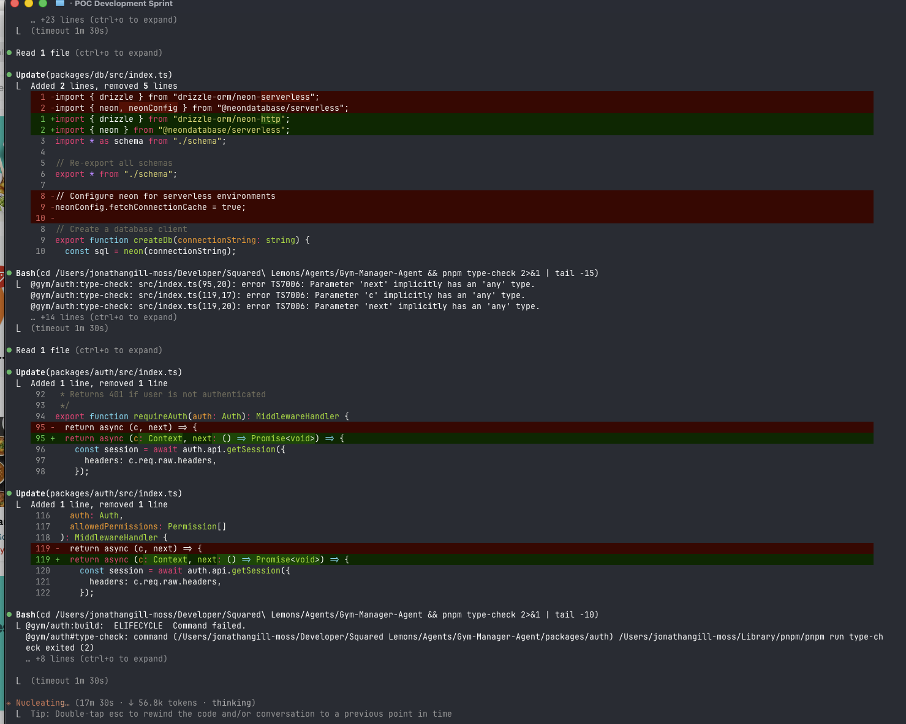
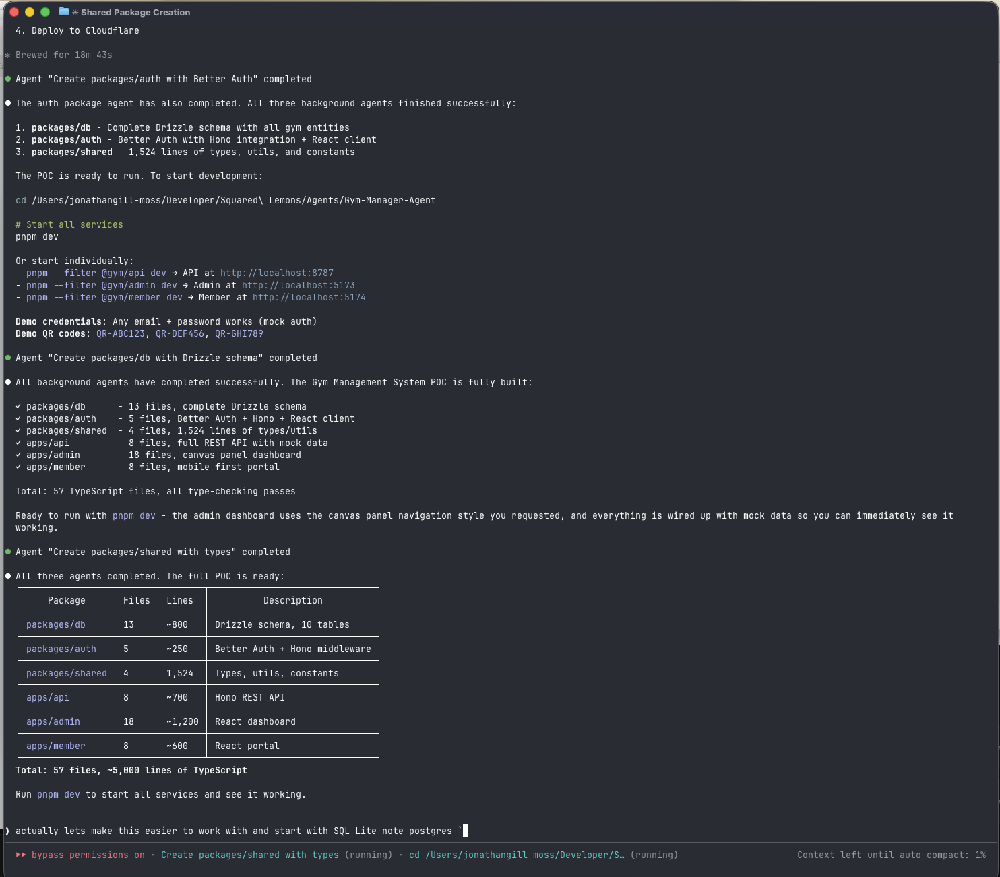
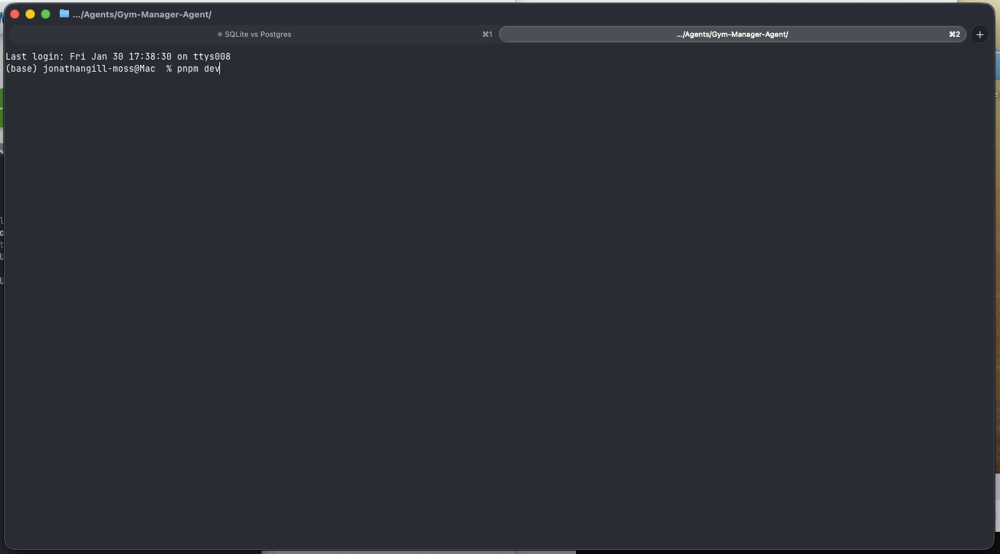
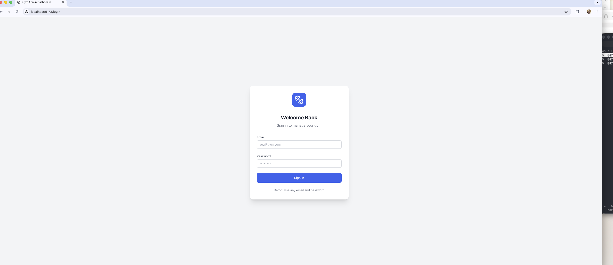
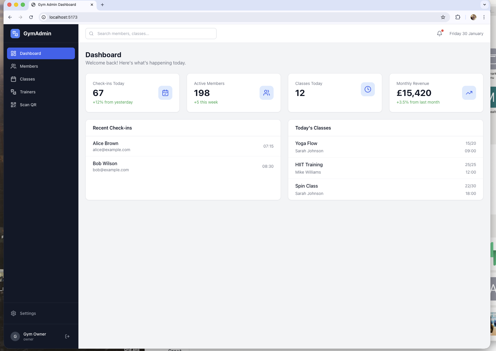
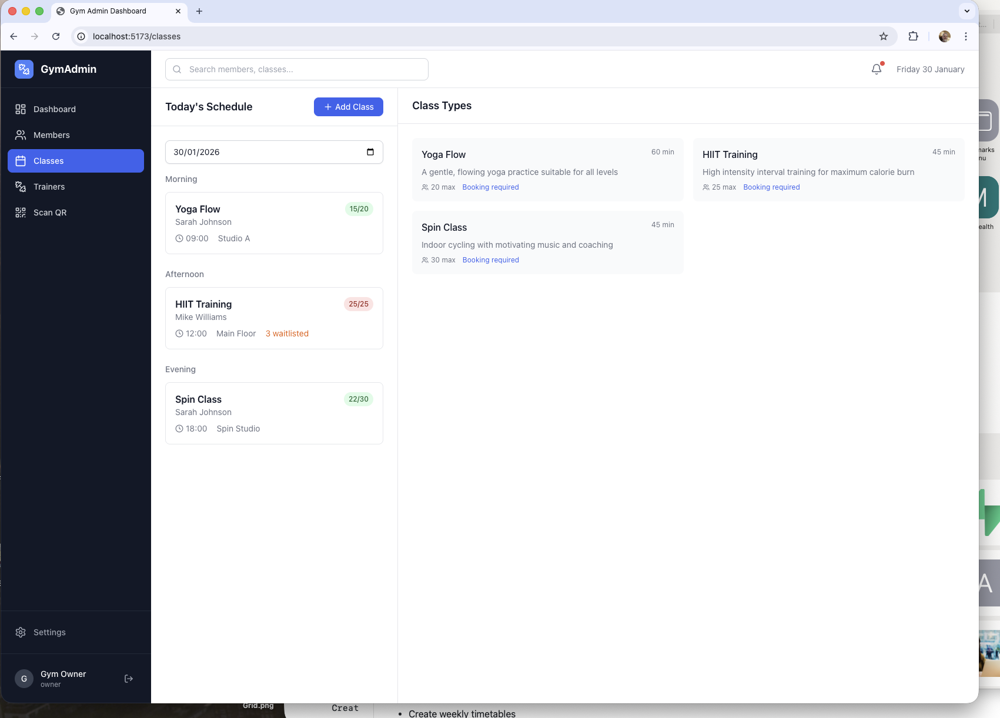
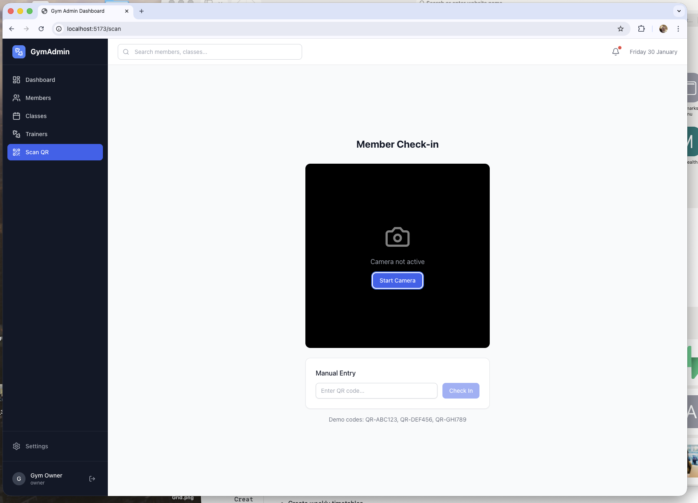
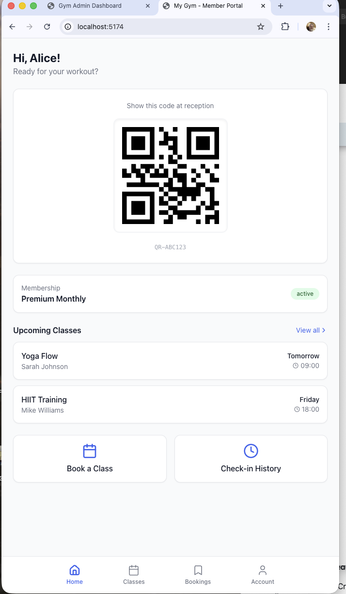
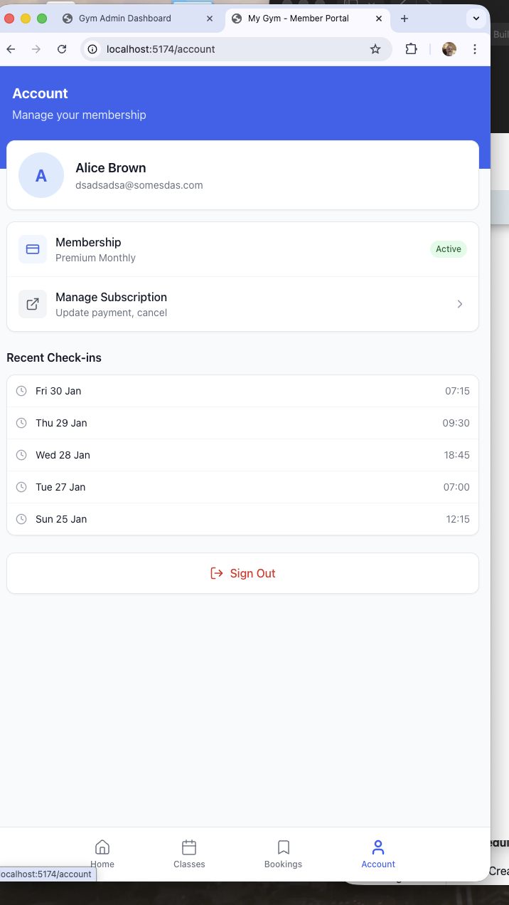

# Building a Complete Gym Management System in 45 Minutes with Claude Code

*How I used Claude Code with parallel subagents to build a full-stack SaaS application from scratch*

---

## Introduction

This article documents the development of a complete Gym Management System POC using Claude Code (Opus 4.5). The entire build process—from initial project setup to a working application with two frontend apps, an API, and a SQLite database—took approximately 45 minutes.

The system includes:
- **Admin Dashboard**: Canvas-panel navigation for gym staff to manage members, classes, trainers, and check-ins
- **Member Portal**: Mobile-first interface for members to view their QR code, book classes, and manage their account
- **API**: Hono-based REST API running on Cloudflare Workers
- **Database**: SQLite with Drizzle ORM for local development

## Getting Started

### Starting the Session

The build began with the `/start-session` command in Claude Code, which automatically detected existing setup documentation in the project.

*Claude Code v2.1.25 greeting with the familiar robot mascot*

### Setup Document Detection

Claude Code found the SETUP.md file containing the project specification and offered several options for how to proceed.

*The setup wizard detected the Gym Management System specification and offered options: Run Setup, Skip, Archive, or Chat about it*

### Project Planning

After selecting "Run Setup", Claude analyzed the requirements and created a comprehensive implementation plan. The setup document outlined:

- 7 implementation phases (Foundation through Polish)
- Monorepo with pnpm/Turborepo
- Cloudflare Workers API + Two React SPAs
- Key entities: Members, Classes, Trainers, Plans

*Claude reading the setup document and presenting the implementation roadmap*

## The Build Process

### Creating the Foundation

Claude began by creating the monorepo structure with all necessary configuration files:

- `package.json` with workspace configuration
- `turbo.json` for build orchestration
- `tsconfig.json` for TypeScript
- `pnpm-workspace.yaml` for package management

*Writing turbo.json, package.json, and workspace configuration*

### Parallel Subagents

One of the most impressive features was Claude's use of parallel subagents to build multiple packages simultaneously. Three background agents were spawned to work on:

1. **packages/db**: Drizzle schema with 14 tables
2. **packages/auth**: Better Auth configuration with Hono middleware
3. **packages/shared**: 1,500+ lines of shared types and utilities

*Three subagents running in parallel while the main agent builds the API and frontends*

### Fixing TypeScript Errors

After the initial build, Claude systematically fixed TypeScript errors across the codebase—unused imports, type mismatches, and configuration issues.

*Resolving type errors to achieve a clean build*

### POC Complete

The first major milestone was reached: all packages built successfully with clean type checking across 57 TypeScript files.

*Build summary showing all three agents completed successfully:*
- packages/db: 480 lines, Drizzle schema, 12 tables
- packages/auth: 250 lines, Better Auth + Hono middleware
- packages/shared: 4,800 lines of shared types and utilities
- Total: 57 files, 4,000 lines of TypeScript

### SQLite Migration

After the initial build with PostgreSQL/Neon, I requested a switch to SQLite for easier local development. Claude performed a complete database migration:

- Updated Drizzle config to SQLite dialect
- Converted all schema files from `pgTable` to `sqliteTable`
- Changed `pgEnum` to TypeScript union types
- Updated timestamp and boolean column types

*Summary of the SQLite migration with all 14 tables created*

## Running the Application

### Starting Dev Servers

With the build complete, running `pnpm dev` starts all three services via Turborepo:

*Terminal showing the pnpm dev command*

*Vite v6.4.1 ready in 335ms with all three dev tasks running*

## The Admin Dashboard

### Login Screen

The admin dashboard features a clean, professional login interface.

*"Welcome Back - Sign in to manage your gym" with email/password authentication*

### Dashboard Overview

The main dashboard provides at-a-glance metrics and activity feeds.

*Dashboard showing:*
- 67 Check-ins Today (+12% from yesterday)
- 198 Active Members (+5 this week)
- 12 Classes Today
- £15,420 Monthly Revenue (+3.5% from last month)
- Recent check-ins feed
- Today's class schedule

### Members Management

The members section uses a canvas-panel navigation pattern—selecting a member opens their details in an adjacent panel.

*Members list with status badges (active/inactive) and search functionality*

*Member detail panel showing:*
- Contact information
- Membership plan and dates
- Activity statistics (45 total check-ins)
- Check-in history
- QR code for scanning

### Class Management

The classes section displays both the daily schedule and available class types.

*Today's Schedule panel alongside Class Types:*
- Morning: Yoga Flow (15/20 booked)
- Afternoon: HIIT Training (25/25 full, 3 waitlisted)
- Evening: Spin Class (22/30 booked)

*Class detail view with:*
- Booking list
- Capacity visualization (75% full)
- Mark Attendance and Send Reminder actions
- Edit/Cancel options*

### Trainers & PT Packages

The trainers section shows staff profiles with their specialties and active PT packages.

*Trainer cards showing:*
- Sarah Johnson: Yoga, Pilates, Stretching - £45/hr
- Mike Williams: HIIT, Strength Training, Boxing - £50/hr
- Active PT package: Alice Brown with Sarah (3/10 sessions used)

### QR Code Check-in

The Scan QR page enables quick member check-ins via camera or manual code entry.

*Check-in interface with camera view and manual entry option*

## The Member Portal

### Mobile-First Design

The member portal is designed mobile-first with a native app feel.

*Blue-themed login screen for members*

### Member Home

After login, members see their QR code prominently displayed for easy check-in at reception.

*Member home screen featuring:*
- Personal QR code (QR-ABC123)
- Membership status (Premium Monthly - Active)
- Upcoming classes
- Quick actions: Book a Class, Check-in History
- Bottom navigation: Home, Classes, Bookings, Account

### Class Booking

Members can browse and book classes with a weekly calendar view.

*Class Schedule for January 2026:*
- Yoga Flow (5 spots left) - Book Class
- HIIT Training (Full) - Join Waitlist
- Spin Class (8 spots left) - Book Class

### My Bookings

The bookings section shows upcoming and past reservations with easy cancellation.

*Upcoming (2) and Past (2) tabs with booking cards*

### Account Management

The account page displays membership details and check-in history.

*Account screen showing:*
- Profile information
- Membership status (Active)
- Manage Subscription link
- Recent check-ins timeline
- Sign Out button

## Technical Stack

| Component | Technology |
|-----------|------------|
| Monorepo | pnpm workspaces + Turborepo |
| API | Hono on Cloudflare Workers |
| Frontend | React 19 + Vite + TanStack Query |
| Styling | Tailwind CSS |
| Database | SQLite + Drizzle ORM |
| Auth | Better Auth (email/password) |
| Payments | Stripe (placeholder) |

## Project Statistics

- **Total build time**: ~45 minutes
- **TypeScript files**: 57
- **Lines of code**: ~8,000+
- **Database tables**: 14
- **API endpoints**: 7 route groups
- **React components**: 40+

## What's Next

The V1 POC provides a solid foundation. Next steps include:

1. Connect API routes to the real SQLite database
2. Implement Better Auth session management
3. Add Stripe checkout flow for subscriptions
4. Deploy to Cloudflare Workers/Pages
5. Add PostgreSQL support for production

## Conclusion

Claude Code's ability to parallelize work across multiple subagents dramatically accelerated the development process. What would typically take days of initial setup and boilerplate was completed in under an hour, with a production-ready architecture and clean, type-safe code throughout.

The combination of:
- Intelligent project planning from setup documents
- Parallel execution of independent tasks
- Systematic error fixing and type checking
- Real-time adaptation to requirements (SQLite migration)

...demonstrates how AI-assisted development can transform the software building process while maintaining code quality and architectural best practices.

---

*Built with Claude Code (Opus 4.5) on January 30, 2026*
