# New Feature Workflow: A Reusable Feature Development Pattern

This document describes the automated feature-building workflow for the `/new-feature` command. The pattern combines **Feature-Dev agents**, **Ralph Loop iteration**, **automated testing**, and **documentation lookup** into a complete autonomous build pipeline.

Use this workflow when building any new feature in a codebase.

---

## Overview

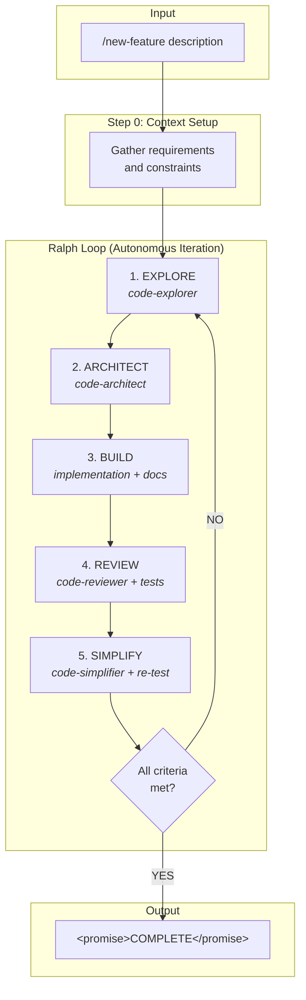

---

## Component Breakdown

### 1. Context Setup (Step 0)

Before building, gather all necessary context. This ensures the feature is built correctly from the start.

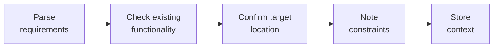

**Why this matters:**
- Prevents building in the wrong location
- Ensures compatibility with existing code
- Creates clear scope boundaries

---

### 2. Ralph Loop (Autonomous Iteration)

The Ralph Loop provides autonomous iteration until a completion condition is met.

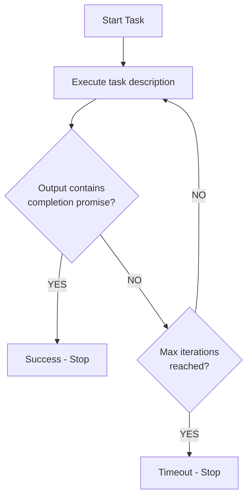

**Command structure:**
```bash
/ralph-loop "[TASK DESCRIPTION]" --completion-promise "[PROMISE_TEXT]" --max-iterations [N]
```

**Example:**
```bash
/ralph-loop "Build a user authentication feature. Follow Feature-Dev workflow..."
  --completion-promise "FEATURE COMPLETE"
  --max-iterations 15
```

**When it outputs:**
```
<promise>FEATURE COMPLETE</promise>
```
The loop terminates successfully.

**Key benefits:**
- No manual intervention required
- Self-corrects on failures
- Prevents infinite loops via max iterations

---

### 3. Feature-Dev Agents

The Feature-Dev plugin provides specialized agents for structured development.

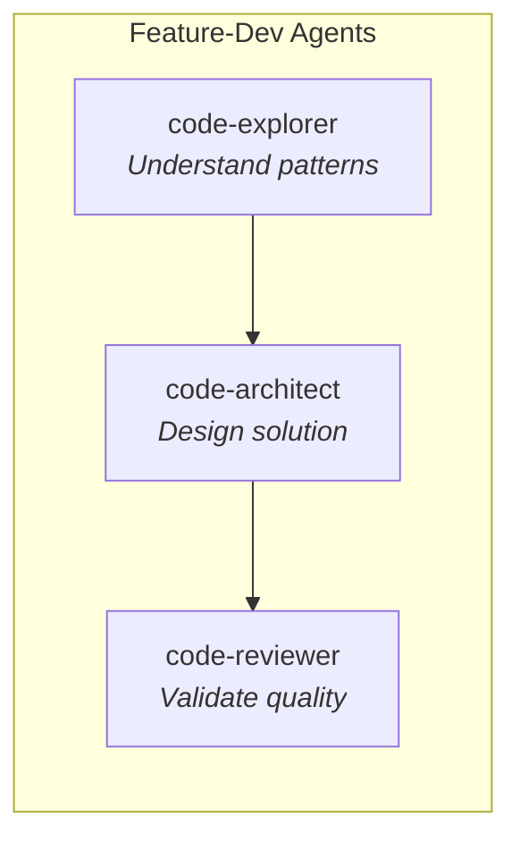

#### 3.1 code-explorer

**Purpose:** Understand existing patterns before building.

**What it does:**
- Analyzes existing file structure
- Traces execution paths
- Maps architecture layers
- Documents patterns and abstractions
- Identifies dependencies

**When to use:**
- Before building anything new
- When inheriting unfamiliar codebase
- To understand how similar features work

**Example prompt:**
```
Explore the existing infrastructure:
- File structure and patterns
- State management approach
- API integration patterns
- How similar features are implemented
```

#### 3.2 code-architect

**Purpose:** Design the solution before implementation.

**What it does:**
- Analyzes requirements
- Examines existing patterns
- Creates implementation blueprint
- Specifies files to create/modify
- Designs component structure
- Defines data flows

**When to use:**
- After exploration, before building
- When multiple approaches exist
- For complex multi-file features

**Example prompt:**
```
Design the feature for [description]:
- Component/module breakdown
- File structure
- API contracts
- Data flow
- Integration points
```

#### 3.3 code-reviewer

**Purpose:** Validate quality before testing.

**What it does:**
- Reviews for bugs and logic errors
- Checks security vulnerabilities
- Validates code quality
- Ensures adherence to conventions
- Uses confidence-based filtering

**When to use:**
- After implementation, before integration tests
- To catch issues early
- To validate against project standards

**Example prompt:**
```
Review the implementation:
- Code follows project patterns
- Error handling is complete
- Security considerations addressed
- Performance is acceptable
- Tests are comprehensive
```

---

### 4. Automated Testing

Automated testing validates the built feature works correctly.

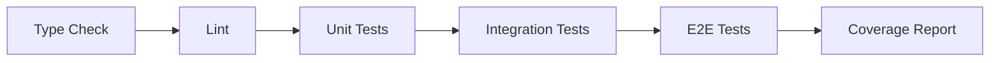

**Test categories:**

| Category | Tools | What to Check |
|----------|-------|---------------|
| Unit tests | Jest, Vitest, pytest | Individual functions/methods |
| Integration tests | Testing libraries | Component interactions |
| E2E tests | Playwright, Cypress | Full user flows |
| API tests | curl, fetch, Postman | Endpoints work correctly |
| Type checking | TypeScript, mypy | Type safety |
| Linting | ESLint, Prettier | Code style |

**Prerequisite:** Development environment must be properly set up.

---

### 5. Documentation Lookup

Query up-to-date library documentation during build.

**When to use:**
- Before implementing library-dependent features
- When unsure about API usage
- To get current best practices

**Common sources:**
- Official documentation
- GitHub READMEs
- Context7 (for Claude Code)
- Package documentation

---

### 6. Code Simplifier

The final refinement step before completion.

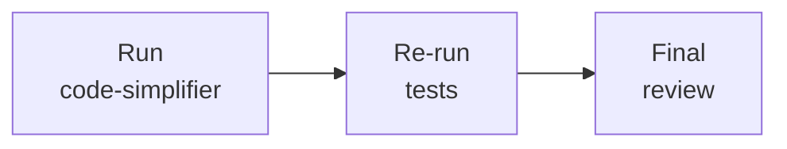

**What it does:**
- Removes redundant code
- Improves clarity and maintainability
- Ensures consistent style
- Preserves all functionality

**Why this matters:**
- Catches over-engineering
- Produces cleaner final output
- Validates stability after refactoring

---

## Complete Workflow Specification

```mermaid
flowchart TB
    subgraph Phase0["Phase 0: Context Setup"]
        P0A["Parse requirements"]
        P0B["Identify target location"]
        P0C["Check existing code"]
        P0D["Note constraints"]
    end

    subgraph Phase05["Phase 0.5: Configuration"]
        P05A["Determine scope"]
        P05B["Identify configs"]
        P05C["Store settings"]
    end

    subgraph Phase1["Phase 1: EXPLORE"]
        P1A["Analyze patterns"]
        P1B["Map dependencies"]
        P1C["Document conventions"]
        P1D["Identify reusables"]
    end

    subgraph Phase2["Phase 2: ARCHITECT"]
        P2A["Design structure"]
        P2B["Plan file changes"]
        P2C["Specify APIs"]
        P2D["Define data flows"]
    end

    subgraph Phase3["Phase 3: BUILD"]
        P3A["Read context"]
        P3B["Query docs"]
        P3C["Generate files"]
        P3D["Create config"]
    end

    subgraph Phase4["Phase 4: REVIEW"]
        P4A["Code review"]
        P4B["Run tests"]
        P4C["Document results"]
    end

    subgraph Phase5["Phase 5: SIMPLIFY"]
        P5A["Refine code"]
        P5B["Re-run tests"]
        P5C["Verify stability"]
    end

    Phase0 --> Phase05
    Phase05 --> Phase1
    Phase1 --> Phase2
    Phase2 --> Phase3
    Phase3 --> Phase4
    Phase4 --> Phase5
```

---

## Completion Criteria

Define explicit criteria that must ALL be true before outputting the completion promise.

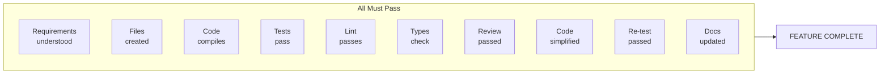

**Generic feature criteria:**

| # | Criterion | Verification |
|---|-----------|--------------|
| 1 | Requirements understood | Feature matches description |
| 2 | Files created | All necessary files exist |
| 3 | Code compiles/runs | No syntax or runtime errors |
| 4 | Tests pass | All automated tests green |
| 5 | Linting passes | No style violations |
| 6 | Type checking passes | No type errors (if applicable) |
| 7 | Code review passed | No high-severity issues |
| 8 | Code simplified | Simplifier agent completed |
| 9 | Re-test passed | Tests pass after simplification |
| 10 | Documentation updated | README/docs reflect changes |

**Completion output:**
```
<promise>FEATURE COMPLETE</promise>
```

---

## Cancellation

Provide a way to stop mid-build:
```bash
/cancel-ralph
```

---

## Command Template

```markdown
---
name: new-feature
description: Build a complete feature using Feature-Dev workflow and Ralph Loop
allowed-tools: Skill
---

# Build New Feature

Build a complete, tested feature using Feature-Dev workflow with Ralph Loop.

**Input:** $ARGUMENTS

---

## Step 0: Context Setup
[Context gathering logic]

---

## Step 0.5: Configuration
[Configuration options]

---

## How It Works
[Diagram and explanation]

---

## The Five Phases
[Phase descriptions with agent assignments]

---

## Completion Criteria
[Explicit checklist]

---

## Starting Now

/ralph-loop "[TASK DESCRIPTION]

Follow the Feature-Dev workflow:
1. EXPLORE - Use code-explorer agent
2. ARCHITECT - Use code-architect agent
3. BUILD - Generate the implementation
4. REVIEW - Use code-reviewer agent + automated tests
5. SIMPLIFY - Use code-simplifier agent, then re-test

Analyze existing code:
- [List relevant files to examine]

Create files:
- [List output files]

Test the implementation:
- [List test commands]

Output <promise>[PROMISE_TEXT]</promise> when ALL criteria are met."
  --completion-promise "[PROMISE_TEXT]"
  --max-iterations 15
```

---

## Adapting for Specific Feature Types

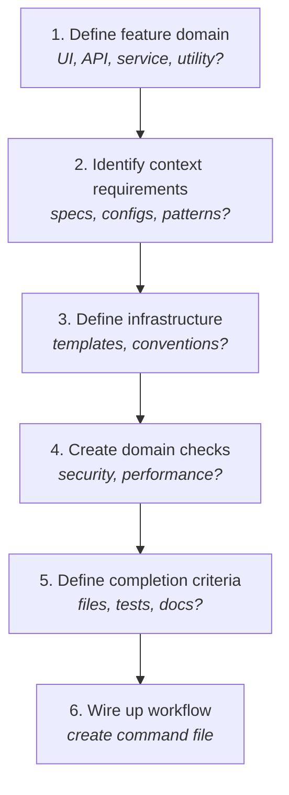

---

## Plugin Dependencies

The following Claude Code plugins are recommended:

| Plugin | Purpose | Phase Used |
|--------|---------|------------|
| `ralph-loop` | Autonomous iteration with completion promise | Orchestration |
| `feature-dev` | code-explorer, code-architect, code-reviewer agents | Explore, Architect, Review |
| `frontend-design` | Design-focused UI component building | Build (UI features) |
| `code-simplifier` | Code refinement and cleanup | Simplify |
| `playwright` | Browser-based E2E testing (if applicable) | Review, Simplify |
| `context7` | Up-to-date library documentation lookup | Build |

**Enable in `.claude/settings.json`:**
```json
{
  "enabledPlugins": {
    "ralph-loop@claude-plugins-official": true,
    "feature-dev@claude-plugins-official": true,
    "frontend-design@claude-plugins-official": true,
    "code-simplifier@claude-plugins-official": true,
    "playwright@claude-plugins-official": true,
    "context7@claude-plugins-official": true
  }
}
```

---

## Example: Building a REST API Endpoint

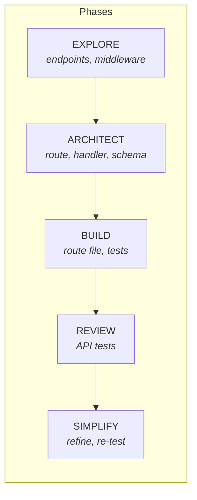

```markdown
---
name: new-feature
description: Build a complete API endpoint using Feature-Dev workflow
allowed-tools: Skill
---

# Build API Endpoint

## Step 0: Context Setup
- Identify API version and module
- Check existing endpoint patterns
- Note authentication requirements

## Phases
1. EXPLORE: Analyze existing endpoints, middleware, validation patterns
2. ARCHITECT: Design route, handler, validation, response schema
3. BUILD: Generate route file, update route index, create tests
4. REVIEW: code-reviewer + API tests
5. SIMPLIFY: Refine, re-test

## Completion Criteria
- Route file created
- Route registered in index
- Returns correct status codes
- Validation rejects bad input
- Tests pass
- API documentation updated

## Starting Now
/ralph-loop "Build endpoint for: $ARGUMENTS..."
  --completion-promise "FEATURE COMPLETE"
  --max-iterations 10
```

---

## Example: Building a React Component

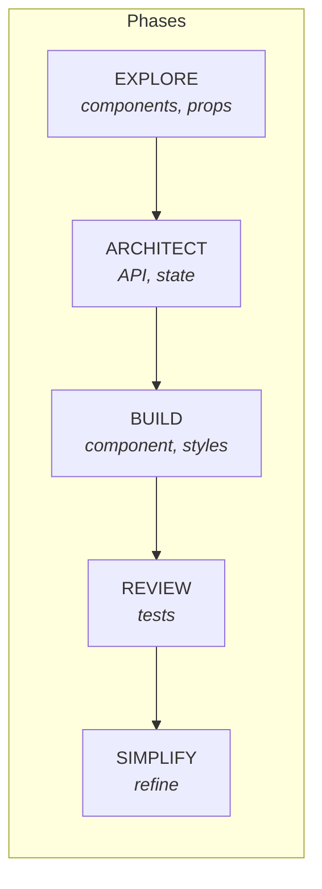

```markdown
---
name: new-feature
description: Build a complete React component using Feature-Dev workflow
allowed-tools: Skill
---

# Build React Component

## Step 0: Context Setup
- Identify component location
- Check existing component patterns
- Note styling approach (CSS modules, Tailwind, etc.)

## Phases
1. EXPLORE: Analyze existing components, props patterns, state management
2. ARCHITECT: Design component API, props interface, internal state
3. BUILD: Generate component file, styles, tests
4. REVIEW: code-reviewer + component tests
5. SIMPLIFY: Refine, re-test

## Completion Criteria
- Component file created
- Props interface defined
- Styles implemented
- Unit tests written
- Storybook story (if applicable)
- Tests pass

## Starting Now
/ralph-loop "Build component for: $ARGUMENTS..."
  --completion-promise "FEATURE COMPLETE"
  --max-iterations 10
```

---

## Example: Building a Database Migration

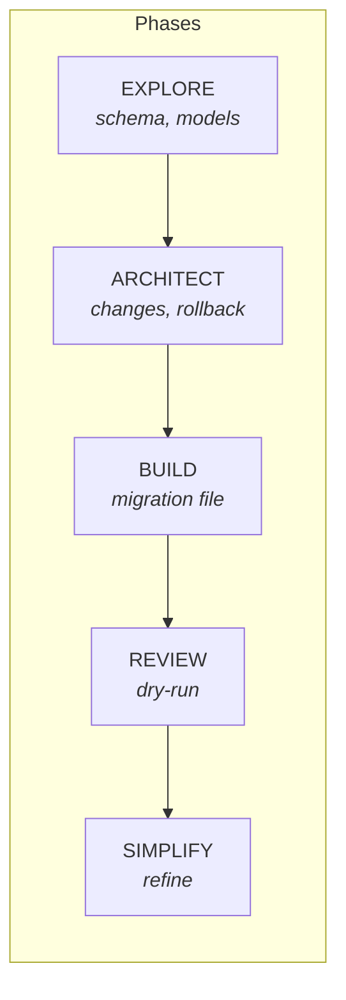

```markdown
---
name: new-feature
description: Build a database migration using Feature-Dev workflow
allowed-tools: Skill
---

# Build Database Migration

## Step 0: Context Setup
- Identify database type
- Check existing migration patterns
- Note ORM/query builder in use

## Phases
1. EXPLORE: Analyze existing schema, migrations, model patterns
2. ARCHITECT: Design schema changes, migration steps, rollback plan
3. BUILD: Generate migration file, update models
4. REVIEW: code-reviewer + migration dry-run
5. SIMPLIFY: Refine, re-test

## Completion Criteria
- Migration file created
- Up migration works
- Down migration works (rollback)
- Models updated
- No data loss on rollback
- Tests pass

## Starting Now
/ralph-loop "Build migration for: $ARGUMENTS..."
  --completion-promise "FEATURE COMPLETE"
  --max-iterations 10
```

---

## Troubleshooting

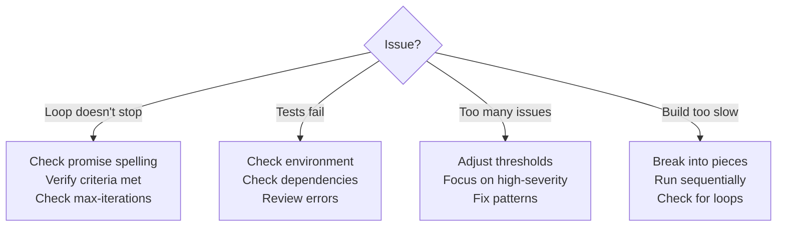

---

## Key Principles

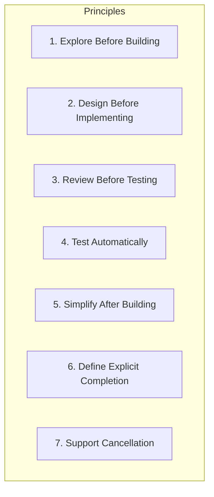

1. **Explore Before Building** - Never generate code without understanding existing patterns first
2. **Design Before Implementing** - Architecture phase prevents wasted iteration cycles
3. **Review Before Testing** - Code review catches issues cheaper than integration tests
4. **Test Automatically** - Automated tests provide objective pass/fail criteria
5. **Simplify After Building** - Refinement produces cleaner output without losing functionality
6. **Define Explicit Completion** - Clear criteria prevent premature or infinite iteration
7. **Support Cancellation** - Users must be able to stop long-running builds

---

## Summary

This workflow pattern provides:

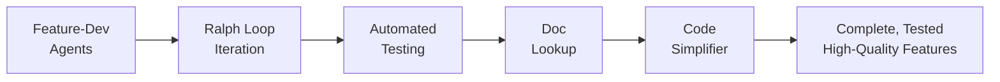

1. **Structured development** via Feature-Dev agents
2. **Autonomous iteration** via Ralph Loop
3. **Objective validation** via automated testing
4. **Current documentation** via documentation lookup
5. **Quality refinement** via code-simplifier

The combination enables building complete, tested, high-quality features with minimal manual intervention.
