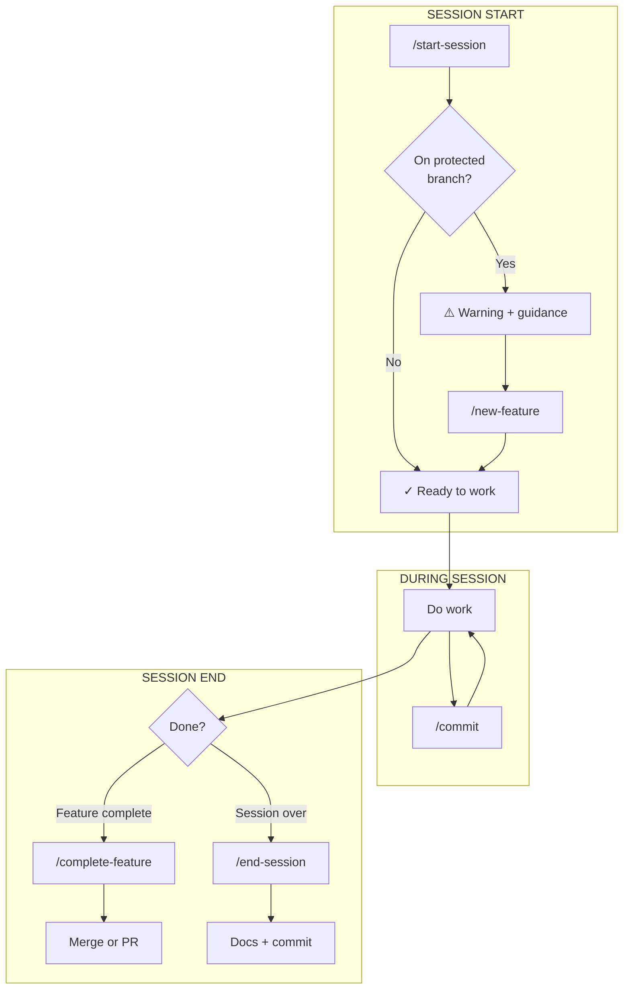

# Session Git Workflow

[← Back to Workflows](README.md) · [← Back to Templates](../README.md)

---

The core workflow that keeps your codebase safe. Every spawned project inherits this discipline.

---

## Overview



---

## The Five Commands

| Command | When to Use | What It Does |
|---------|-------------|--------------|
| `/start-session` | Beginning of work | Checks branch safety, loads context, shows status |
| `/new-feature "desc"` | Starting new work | Creates feature branch or worktree |
| `/commit` | During work | Quick commit with approval |
| `/complete-feature` | Feature is done | Merge to main or create PR |
| `/end-session` | Done for now | Update docs, capture learnings, commit |

---

## Protected Branch Enforcement

When you (or Claude) tries to make changes on `main`, `master`, `develop`, or `release/*`:

```
━━━━━━━━━━━━━━━━━━━━━━━━━━━━━━━━━━━━━━━━━━━━━━━━━━
⚠️  PROTECTED BRANCH WARNING
━━━━━━━━━━━━━━━━━━━━━━━━━━━━━━━━━━━━━━━━━━━━━━━━━━

You're on main — a protected branch.
Direct changes here are not allowed to keep the codebase safe.

To start safe work:
→ /new-feature "short-description"
━━━━━━━━━━━━━━━━━━━━━━━━━━━━━━━━━━━━━━━━━━━━━━━━━━
```

This teaches git discipline from day one. Beginners learn the right habits; experienced developers appreciate the guardrails.

---

## Protected Branch Patterns

| Pattern | Description |
|---------|-------------|
| `main` | Primary branch |
| `master` | Legacy primary branch |
| `develop` | Integration branch |
| `release/*` | Release branches |

---

## Worktrees

> **Worktree**: A separate working directory linked to the same git repository. Work on two branches simultaneously without stashing or losing context.

When you run `/new-feature`, you can choose between:

- **Regular branch**: Standard git branch, switches your working directory
- **Worktree**: Creates `../worktrees/[name]` with its own working directory

Use worktrees when you need to keep current work intact while starting something new.

---

## Example Session

```
# 1. Start your session
/start-session

# 2. You're on main - create feature branch
/new-feature "add dark mode support"

# 3. Work on the feature...
#    (make changes, test, iterate)

# 4. Commit progress
/commit

# 5. More work...

# 6. Feature complete - merge it
/complete-feature

# 7. End session with documentation
/end-session
```

---

## Key Principles

1. **Never modify protected branches directly** — Creates muscle memory
2. **Session has clear boundaries** — Start, work, end
3. **Documentation stays current** — Updated at session end
4. **Commit is the final sign-off** — User reviews everything first
5. **Local data stays local** — Session logs don't clutter git
6. **Learnings compound** — Insights captured for future sessions
